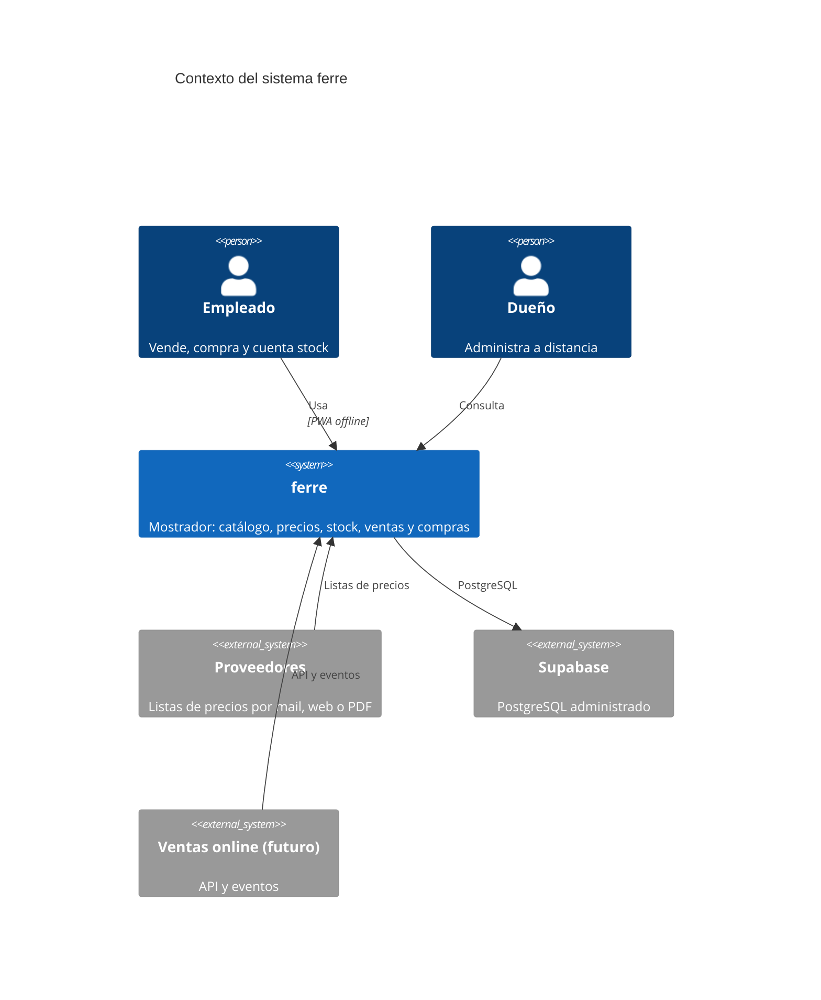
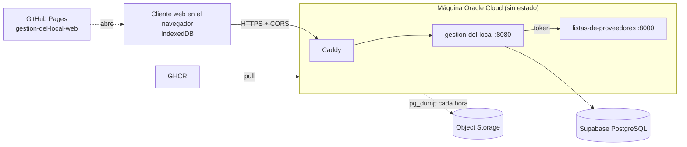

# Arquitectura

Sistema de gestión para una ferretería de barrio: un local, un empleado, ~50 proveedores
con listas en Excel, ventas que hoy se anotan en un cuaderno. Reemplaza el cuaderno sin
retrasar al empleado, mantiene los precios al día sin cargarlos a mano, registra stock,
ventas y compras, y deja que el dueño administre a distancia.

## Contexto

Fuente: [diagrams/contexto.mmd](diagrams/contexto.mmd).

## Componentes

| Componente | Qué hace | Tecnología | ADR |
|---|---|---|---|
| `microservices/gestion-del-local` | Lo que pasa dentro del local: catálogo y precios, ventas, cuenta corriente, compras, stock. Dueño de la base | Node 22, Hono, TypeScript | [001](adr/ADR-001-stack-tecnologico.md), [010](adr/ADR-010-servicios-clientes-y-librerias.md) |
| `clientes/gestion-del-local-web` | Pantalla del empleado y del dueño; funciona sin internet con IndexedDB; publicada en GitHub Pages | React, Vite, PWA | [005](adr/ADR-005-indexeddb-directo.md), [010](adr/ADR-010-servicios-clientes-y-librerias.md) |
| `libraries/calculo-de-precios` | Costo neto, margen y precio con su explicación; compartida entre servicio y cliente | TypeScript | [001](adr/ADR-001-stack-tecnologico.md) |
| `microservices/listas-de-proveedores` | Recibe listas de proveedores (Excel, PDF, mail, portal) y las convierte en precios | Python 3.12, FastAPI, openpyxl | [001](adr/ADR-001-stack-tecnologico.md) |
| `infrastructure/reverse-proxy` | TLS automático y única puerta de entrada | Caddy | [006](adr/ADR-006-caddy.md) |
| Base de datos | PostgreSQL administrado, usado por cadena de conexión | Supabase | [002](adr/ADR-002-base-de-datos-respaldo-y-disponibilidad.md) |

## Límites y comunicación

- `gestion-del-local` es el único dueño de la base de datos. Ningún otro servicio la
  toca ([ADR-003](adr/ADR-003-limites-del-microservicio.md)).
- `gestion-del-local` llama a `listas-de-proveedores` por HTTP con un token de servicio
  compartido (`TOKEN_SERVICIO`). `listas-de-proveedores` no tiene estado ni base.
- El cliente web vive en otro origen (GitHub Pages) y habla con la API con CORS y un
  token de sesión en cabecera ([ADR-010](adr/ADR-010-servicios-clientes-y-librerias.md)).
- Los eventos de dominio se guardan en una tabla de eventos en JSON versionado. Hoy los
  consume la propia app; un futuro servicio de ventas online los lee desde ahí.
- El cliente web es una PWA: un service worker precachea la app entera, así abre sin
  conexión y se actualiza sola. Catálogo, stock, clientes, ventas de 7 días y la cola
  única de cambios pendientes viven en IndexedDB (`almacen.ts`, `cola.ts`). Todo cambio
  del mostrador se intenta enviar y, sin red, se encola y sale en orden al reconectar;
  la API y Google nunca pasan por el caché.

## Despliegue

Fuente: [diagrams/despliegue.mmd](diagrams/despliegue.mmd). Detalle en
[DEPLOYMENT.md](DEPLOYMENT.md).

## Modelo de datos

En [MODELO.md](MODELO.md): tablas, reglas comunes y cómo se migra el esquema.

## Decisiones

Todas en [adr/README.md](adr/README.md). Las que más condicionan el diseño: el stack
offline-first (001), la base en Supabase con la máquina sin estado (002), y los límites
del microservicio (003).
