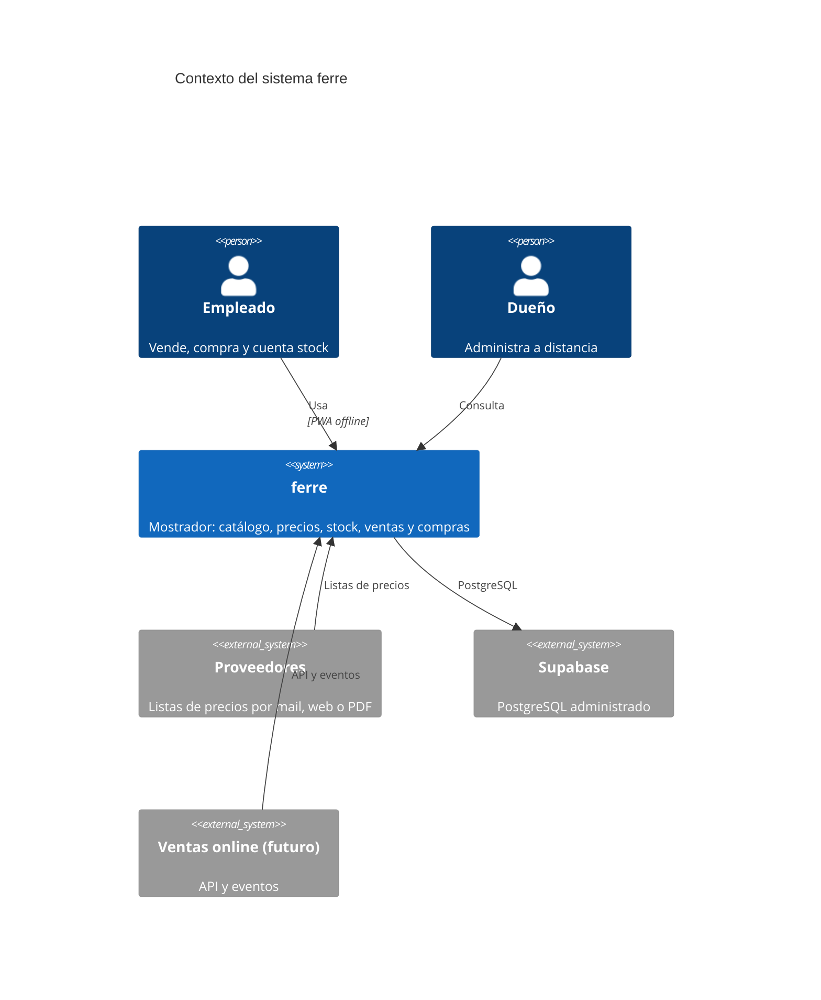
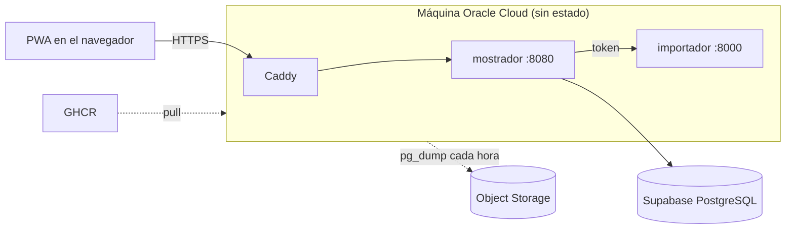

# Arquitectura

Sistema de gestión para una ferretería de barrio: un local, un empleado, ~50 proveedores
con listas en Excel, ventas que hoy se anotan en un cuaderno. Reemplaza el cuaderno sin
retrasar al empleado, mantiene los precios al día sin cargarlos a mano, registra stock,
ventas y compras, y deja que el dueño administre a distancia.

## Contexto

Fuente: [diagrams/contexto.mmd](diagrams/contexto.mmd).

## Componentes

| Componente | Qué hace | Tecnología | ADR |
|---|---|---|---|
| `microservices/mostrador` | API del mostrador (catálogo, precios, stock, ventas, compras) y sirve la PWA compilada | Node 22, Hono, TypeScript | [001](adr/ADR-001-stack-tecnologico.md) |
| `mostrador/pwa` | Interfaz del empleado y del dueño; funciona sin internet con IndexedDB | React, Vite | [001](adr/ADR-001-stack-tecnologico.md), [005](adr/ADR-005-indexeddb-directo.md) |
| `mostrador/precios` | Cálculo de costo neto, margen y precio con su explicación; compartido entre API y PWA | TypeScript | [001](adr/ADR-001-stack-tecnologico.md) |
| `microservices/importador` | Lee listas de proveedores (Excel, PDF) y devuelve filas normalizadas | Python 3.12, FastAPI, openpyxl | [001](adr/ADR-001-stack-tecnologico.md) |
| `infrastructure/reverse-proxy` | TLS automático y única puerta de entrada | Caddy | [006](adr/ADR-006-caddy.md) |
| Base de datos | PostgreSQL administrado, usado por cadena de conexión | Supabase | [002](adr/ADR-002-base-de-datos-respaldo-y-disponibilidad.md) |

## Límites y comunicación

- `mostrador` es el único dueño de la base de datos. Ningún otro servicio la toca
  ([ADR-003](adr/ADR-003-limites-del-microservicio.md)).
- `mostrador` llama a `importador` por HTTP con un token de servicio compartido
  (`TOKEN_SERVICIO`). `importador` no tiene estado ni base.
- Los eventos de dominio se guardan en una tabla de eventos en JSON versionado. Hoy los
  consume la propia app; un futuro servicio de ventas online los lee desde ahí.
- La PWA guarda catálogo, ventas del día y cola de cambios en IndexedDB, y sincroniza
  cuando hay conexión.

## Despliegue

Fuente: [diagrams/despliegue.mmd](diagrams/despliegue.mmd). Detalle en
[DEPLOYMENT.md](DEPLOYMENT.md).

## Modelo de datos

En [MODELO.md](MODELO.md): tablas, reglas comunes y cómo se migra el esquema.

## Decisiones

Todas en [adr/README.md](adr/README.md). Las que más condicionan el diseño: el stack
offline-first (001), la base en Supabase con la máquina sin estado (002), y los límites
del microservicio (003).
