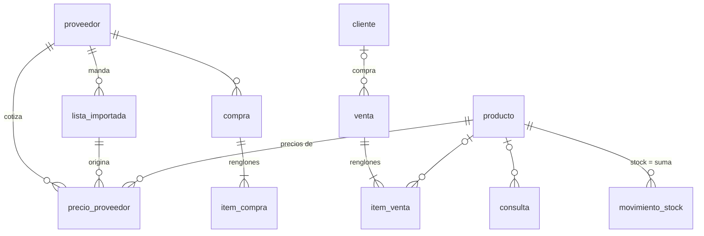

# Modelo de datos

Esquema en `microservices/gestion-del-local/migrations/`, aplicado por el corredor propio al
arrancar la API (issue #6). Diagrama completo en
[diagrams/modelo.mmd](diagrams/modelo.mmd).

## Reglas que cruzan todas las tablas

- **Ids UUID generados en el cliente.** Una venta creada sin conexión no choca al
  sincronizar.
- **Nada se borra físicamente.** `activo` en catálogos, `estado` en documentos.
- **Los históricos no se pisan.** `precio_proveedor`, `movimiento_stock` y `evento` solo
  reciben filas nuevas. "El costo actual" es la fila más reciente; "el stock actual" es
  la suma de movimientos. Así cualquier número se puede explicar (issue #47).
- **Dinero:** `numeric(14,4)` para costos (las listas traen 4 decimales), `numeric(12,2)`
  para precios de venta ya redondeados.
- `creado_en` en todo; `modificado_en` con trigger donde hay actualizaciones.

## Tablas

| Tabla | Qué es | Detalle que importa |
|---|---|---|
| `proveedor` | Quién vende | Si sus precios incluyen IVA, sus descuentos general y por contado (#11), y qué `lector` entiende su planilla |
| `lista_importada` | Cada archivo cargado | Estado pendiente/aplicada/descartada, resumen de cambios, avisos, quién la cargó y quién la aplicó; el archivo se guarda en un volumen para reprocesar (#12) |
| `producto` | Lo que se vende | `margen_elegido` (300/200/100/50/25 o ninguno) y `precio_manual` (#13). Un producto por renglón de lista hasta que #29 los una |
| `precio_proveedor` | Histórico de costos | Precio de lista, descuentos aplicados en orden (JSON), costo neto, IVA, bulto, fecha de la lista |
| `cliente` | Solo los importantes | Si se le permite cuenta corriente |
| `venta` | Un ticket | Medio de pago incluye `cuenta_corriente` (exige cliente); `pagada_en` es el "tachar el renglón" |
| `item_venta` | Un renglón del cuaderno | Guarda costo, margen, precio y explicación **de ese momento**; `producto_id` nulo = ítem libre (#17) |
| `consulta` | Preguntaron y no compraron | Hoy pasa muy seguido y no se anota |
| `compra` / `item_compra` | Ingreso de mercadería (#30) | `sin_comprobante` para los dos proveedores sin factura |
| `movimiento_stock` | Cada entrada o salida | Cantidad con signo; los conteos (#31) generan ajustes con referencia al conteo |
| `sector` | Dónde vive cada producto en el local | Se asigna al contar; el conteo cíclico va por sector (#31) |
| `conteo` / `renglon_conteo` | Un conteo abierto por sector con lo contado | Al cerrar, cada diferencia contra el teórico es un ajuste explicado |
| `evento` | Registro de eventos de dominio (ADR-003) y auditoría | Lleva `usuario_id`: quién hizo qué |
| `usuario` | Quién puede entrar | Gmail autorizado y rol dueño/mostrador; sin contraseñas ([ADR-011](adr/ADR-011-autenticacion-sin-contrasenas.md)) |
| `sesion` | Sesiones abiertas | Token hasheado, dispositivo, vencimiento renovable, revocación |
| `vinculacion` | Login de la laptop por QR | Código de un solo uso aprobado desde el celular |
| `puesto` / `codigo_escaneado` | Laptop vinculada a un celular por QR, y los códigos que el celular le manda | 12 horas de vínculo; lo no entregado se entrega al reconectar (#52) |
| `migracion` | Qué archivos SQL ya corrieron | La crea el corredor |

## Migraciones

Archivos `NNNN_nombre.sql` en orden. El corredor (`src/migraciones.ts`) toma un lock,
crea `migracion` si no existe, y aplica cada archivo pendiente en su propia transacción.
Si uno falla, no queda registrado y la API no arranca. Para un cambio de esquema se
agrega un archivo nuevo; nunca se edita uno aplicado.
