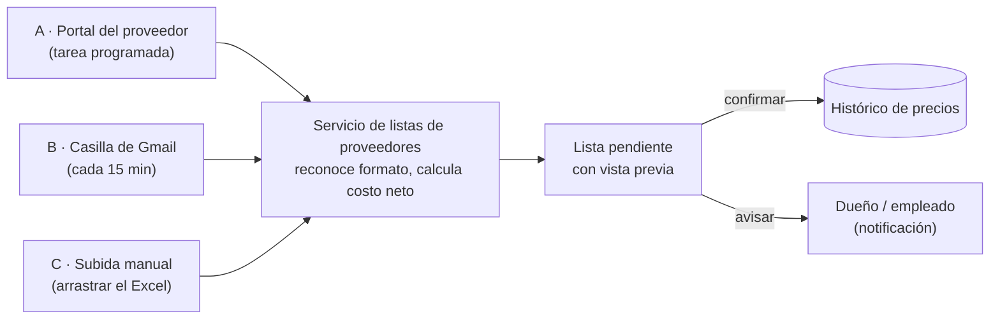

# Proveedores: cómo llegan los precios y qué se puede automatizar

Relevamiento del 2026-09-13 sobre los cuatro proveedores del MVP, a partir de sus
planillas y de sus sitios. Se amplía con el issue #28.

| Proveedor | Cómo llega hoy | Web con precios | Automatizable | Cómo |
|---|---|---|---|---|
| **Ixnova** (HNZ SRL, Castelar) | Excel por mail, 3 hojas, con fecha en el título | **Sí.** Tienda online propia en ixnova.com.ar; precios mayoristas visibles con usuario registrado por CUIT, aprobación inmediata | **Sí, alta** | Conector con usuario del negocio que recorra el catálogo o, mejor, pedirles exportación. Es el candidato del issue #26 |
| **3GE** (Distribuidora 3GE SRL, 3M y otras) | Excel por mail, vía el vendedor | **Parcial.** tresge.com.ar tiene sección de descargas y acceso para clientes con código de cliente y CUIT; la lista de precios parece estar detrás de ese login | **Sí, media** | Con las credenciales del negocio, descargar el archivo de la sección de descargas y pasarlo por el servicio de listas. Confirmar con ellos si el archivo es el mismo Excel |
| **ERPA** (ERPA S.A., Suprabond, Villa Madero) | Excel por mail, exportado de su sistema (lista "comercio") | **No para precios mayoristas.** suprabond.com tiene catálogos PDF sin precios; tienda.suprabond.com es Shopify **minorista**, con precios de venta al público, no los de la lista comercio | **Solo por mail** | Ingesta automática del adjunto (issue #25). Los precios minoristas de la tienda sirven como referencia de precio de venta, no de costo |
| **Comodo** | Excel por mail, vía el vendedor (Matias Banegas), con un Drive de ofertas e imágenes | **No identificado.** No se encontró sitio ni razón social; la lista solo referencia una carpeta de Google Drive | **Solo por mail** | Ingesta automática del adjunto (issue #25). Preguntarle al vendedor si tienen portal |

## Cómo se automatiza la actualización de precios

Los tres canales terminan en el mismo lugar: una **lista pendiente de aplicar** con su
vista previa (nuevos, cambiados, dados de baja) que alguien confirma con un clic
(issue #12). Lo que cambia es cómo llega el archivo. Nunca se aplica una lista sin
confirmación humana: un archivo mal leído puede cambiar miles de precios.

### A · Descarga desde el portal del proveedor

Para los que tienen web con precios mayoristas: **Ixnova** hoy, **3GE** si su sección de
descargas entrega un archivo.

1. El negocio tiene usuario en el portal. Las credenciales van al `.env` del servicio,
   nunca al código.
2. Una tarea programada (semanal, o diaria si el proveedor cambia seguido) entra al
   portal, descarga la lista y la guarda con fecha.
3. Si el archivo es igual al último (mismo hash), no hace nada. Si cambió, lo normaliza
   y crea la lista pendiente.
4. Si el portal cambió y la descarga falla, avisa al dueño con el error en castellano;
   no reintenta a ciegas.

**Ixnova:** no ofrece exportación visible; la tienda muestra precios por producto una
vez logueado. Antes de recorrer el catálogo página por página, **pedirles la
exportación** (ya mandan el Excel por mail: probablemente puedan dejarlo en un enlace
fijo). Si no, el conector recorre la tienda con el usuario del negocio, respetando
pausas, y arma el mismo formato que su Excel. Es el conector del issue #26.

**3GE:** entrar con código de cliente y CUIT a `/descargas/` y bajar la lista. Si es el
mismo Excel que mandan por mail, el servicio de listas ya lo entiende. Confirmar con ellos.

### B · Vinculación con la casilla de correo

Para todos los que mandan la lista por mail: **ERPA, Comodo**, y en la práctica también
Ixnova y 3GE, que llegan por el vendedor. Es el canal que más proveedores cubre de una
vez (issue #25).

1. El dueño autoriza al sistema a **leer** la casilla del negocio con la API de Gmail,
   permiso de solo lectura, con la misma cuenta de Google que usa para entrar al sistema.
2. Cada 15 minutos el servicio busca correos nuevos con adjuntos Excel o PDF.
3. Reconoce el proveedor por **el archivo, no por el remitente**: nombre del archivo
   (`Lista ERPA`, `lista_precios_ixnova_*`, `LISTA GENERAL`) y huella del formato
   (encabezados y posición). Varios proveedores llegan desde la casilla personal del
   mismo vendedor.
4. Adjunto reconocido: normaliza y crea la lista pendiente. Adjunto no reconocido: queda
   en una bandeja "¿de qué proveedor es?" donde se asigna una vez y el sistema aprende.
5. El correo original queda enlazado a la lista para poder verlo.

### C · Subida manual

Siempre disponible, y el único canal hasta que existan A y B (issue #12): arrastrar el
Excel a la pantalla, el sistema detecta el proveedor, muestra la vista previa, confirmar.
Sirve también para el proveedor nuevo que todavía no está configurado y para el PDF que
el reconocimiento automático no entendió.

### Por proveedor

| Proveedor | Canal principal | Respaldo | Frecuencia de cambio | Qué hay que conseguir |
|---|---|---|---|---|
| Ixnova | A (portal) | B (mail) | Semanal | Usuario del negocio en ixnova.com.ar; pedir exportación |
| 3GE | A (descargas con login) | B (mail) | Semanal o quincenal | Código de cliente y CUIT; confirmar que la descarga es el Excel |
| ERPA | B (mail) | C (manual) | Mensual aproximado | Nada: ya llega por mail |
| Comodo | B (mail) | C (manual) | Semanal | Preguntarle al vendedor si existe portal; nombre de la empresa |

## Estado de los lectores

Los cuatro lectores del MVP están hechos (issues #7 a #10) en
`microservices/listas-de-proveedores/listas_de_proveedores/lectores/`. Cada uno
reconoce su planilla por el nombre del archivo o las hojas, y devuelve el mismo formato:
código, descripción, marca, grupo, precio de lista, descuentos aplicados, costo neto sin
IVA con su explicación paso a paso, IVA, bulto, código de barras y precio sugerido cuando
la planilla los trae. Contra las listas reales: Comodo 7.096 filas, Ixnova 4.109 (más 54
ofertas), 3GE 2.167, ERPA 729, ninguna salteada.

## Observaciones

- **Un mismo vendedor manda varias listas** (Comodo, 3GE, Ixnova llegan desde la misma
  casilla personal de Gmail). El reconocimiento de proveedor en el issue #25 no puede
  basarse solo en el remitente: tiene que mirar el nombre del archivo y el formato.
- Otros proveedores vistos en la bandeja del negocio, para el issue #28: Provemet,
  Casa Gancedo, Bulones DC, Cibasa, Saniplast, Complemet, Distribuidora City Bell,
  Protec (tiene portal "ProtecWeb" con usuario).
- Antes de automatizar el acceso a cualquier portal, pedirle al proveedor una
  exportación oficial o su autorización. Un scraper sin permiso se rompe con cada cambio
  de diseño y puede violar sus condiciones de uso.

## Fuentes

- Ixnova: [ixnova.com.ar](https://www.ixnova.com.ar/), [tienda](https://ixnova.com.ar/tienda/)
- 3GE: [tresge.com.ar](https://www.tresge.com.ar/), [proveedores](https://www.tresge.com.ar/proveedores/)
- ERPA / Suprabond: [suprabond.com](https://www.suprabond.com/), [tienda.suprabond.com](https://tienda.suprabond.com/), [El Ferretero](https://elferretero.com.ar/empresas/?key=ERPA+-+SUPRABOND)
