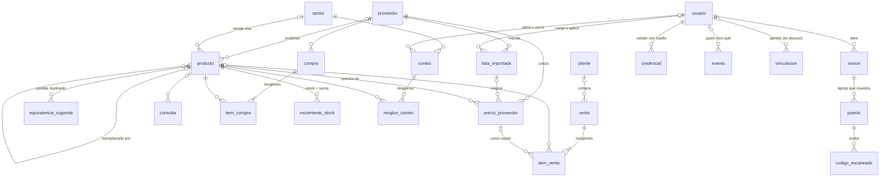

# Data Model: Base del sistema

Modelo de datos completo de `gestion-del-local`, único dueño de la base (ADR-003). Viene de
`docs/MODELO.md` y `docs/diagrams/modelo.mmd`, contrastados columna por columna con las
once migraciones de `microservices/gestion-del-local/migrations/` el 2026-10-10. Donde el
documento y las migraciones no coincidían, acá está lo que dicen las migraciones; las
diferencias están listadas al final.

El esquema lo aplica el corredor propio al arrancar la API, antes de atender (issue #6).

## Diagrama

Todas las tablas y sus relaciones, según las migraciones.

## Reglas que cruzan todas las tablas

- **Ids UUID generados en el cliente.** Una venta creada sin conexión no choca al
  sincronizar. Excepciones: `credencial.id` es el identificador que elige el autenticador
  del teléfono (texto) y `migracion` se identifica por el nombre del archivo.
- **Nada se borra físicamente.** `activo` en catálogos, `estado` en documentos, `revocada_en`
  en sesiones y credenciales. Excepción en el código: los renglones de un conteo abierto
  (`renglon_conteo`) se borran al quitarlos y al unir dos productos que estaban en el mismo
  conteo.
- **Los históricos no se pisan.** `precio_proveedor`, `movimiento_stock` y `evento` solo
  reciben filas nuevas. «El costo actual» es la fila más reciente; «el stock actual» es la
  suma de movimientos. Así cualquier número se puede explicar (issue #47). Excepción en el
  código: unir dos productos duplicados cambia el `producto_id` de filas existentes de
  `precio_proveedor`, `movimiento_stock`, `item_venta`, `item_compra`, `consulta` y
  `renglon_conteo`; qué se movió queda en el evento `producto.unido` y con eso la unión se
  deshace (#29). Nada en la base lo impide: la regla la sostiene el código.
- **Dinero:** `numeric(14,4)` para costos (las listas traen 4 decimales), `numeric(12,2)`
  para precios de venta ya redondeados y totales. Cantidades: `numeric(12,3)`.
- **Fechas de alta y cambio:** `creado_en` en casi todo; `modificado_en`, mantenido por el
  trigger `tocar_modificado_en`, en `proveedor`, `lista_importada`, `producto`, `cliente`,
  `venta`, `compra`, `usuario` y `sector`. Las tablas de acceso usan otros nombres
  (`creada_en`, `abierto_en`, `contado_en`, `aplicada_en`).

## Tablas

| Tabla | Qué es | Detalle que importa |
|---|---|---|
| `proveedor` | Quién vende | Si sus precios incluyen IVA, sus descuentos general y por contado (#11), y qué `lector` entiende su planilla |
| `lista_importada` | Cada archivo cargado | Estado pendiente/aplicando/aplicada/descartada, resumen de cambios, avisos, quién la cargó y quién la aplicó; el archivo se guarda en un volumen para reprocesar (#12) |
| `producto` | Lo que se vende | `margen_elegido`: uno de los botones (300/200/100/50/25), cualquier porcentaje entero tipeado a mano, o ninguno (#13). El precio de venta siempre sale del costo y se redondea para arriba a múltiplos de $1.000. `unidad`: `unidad` (se vende por enteros) o `kg`/`m`/`l` (a granel, con un decimal). Puede tener foto (`foto_url`: sacada con el celular y guardada en el volumen de datos como `/fotos/<uuid>.jpg`, o una dirección externa). Puede tener precios de varios proveedores; `proveedor_preferido_id` decide el costo vigente (por defecto el más barato con lista reciente). Un producto absorbido queda inactivo con `reemplazado_por` (#29) |
| `equivalencia_sugerida` | Posibles duplicados entre proveedores | Por código de barras o descripción normalizada; el dueño une o rechaza (#29) |
| `precio_proveedor` | Histórico de costos | Precio de lista, descuentos aplicados en orden (JSON), costo neto, IVA, bulto, fecha de la lista |
| `cliente` | Solo los importantes | Si se le permite cuenta corriente |
| `venta` | Un ticket | Medio de pago incluye `cuenta_corriente` (exige cliente); `pagada_en` es el «tachar el renglón» |
| `item_venta` | Un renglón del cuaderno | Guarda costo, margen, precio y explicación **de ese momento**; `producto_id` nulo = ítem libre (#17) |
| `consulta` | Preguntaron y no compraron | Hoy pasa muy seguido y no se anota |
| `compra` / `item_compra` | Ingreso de mercadería (#30) | `sin_comprobante` para los dos proveedores sin factura |
| `movimiento_stock` | Cada entrada o salida | Cantidad con signo; los conteos (#31) generan ajustes con referencia al conteo |
| `sector` | Dónde vive cada producto en el local | Se asigna al contar; el conteo cíclico va por sector (#31) |
| `conteo` / `renglon_conteo` | Un conteo abierto por sector con lo contado | Al cerrar, cada diferencia contra el teórico es un ajuste explicado |
| `evento` | Registro de eventos de dominio (ADR-003) y auditoría | Lleva `usuario_id`: quién hizo qué |
| `usuario` | Quién puede entrar | Gmail autorizado y rol dueño/admin/mostrador; sin contraseñas (ADR-011) |
| `sesion` | Sesiones abiertas | Token hasheado, dispositivo, vencimiento renovable, revocación |
| `credencial` | Celulares vinculados por huella (passkeys) | Clave pública por usuario y dispositivo, contador, `revocada_en` (ADR-011, enmienda) |
| `vinculacion` | En desuso desde el 2026-10-09: era el login de la laptop por QR, que se quitó (ADR-011). La tabla queda, sin filas nuevas | Código de un solo uso aprobado desde el celular |
| `puesto` / `codigo_escaneado` | Laptop vinculada a un celular por QR, y los códigos que el celular le manda | 12 horas de vínculo; lo no entregado se entrega al reconectar (#52) |
| `migracion` | Qué archivos SQL ya corrieron | La crea el corredor |

## Columnas

Tal como quedan después de la migración `0011`. PK = clave primaria; → = referencia.

### Catálogo y precios

**`proveedor`**: `id` uuid PK · `nombre` text, único · `precios_incluyen_iva` boolean, por omisión falso · `descuento_general` numeric(6,4), entre 0 y 1 · `descuento_contado` numeric(6,4), entre 0 y 1 · `lector` text, nulo si todavía no tiene (`ixnova`, `comodo`, `tresge`, `erpa`) · `activo` boolean · `creado_en` · `modificado_en`.

**`lista_importada`**: `id` uuid PK · `proveedor_id` → proveedor · `archivo_nombre` text · `archivo_ruta` text, nulo · `fecha_lista` date · `estado` text: `pendiente`, `aplicando`, `aplicada`, `descartada` · `resumen` jsonb (nuevos, modificados, dados de baja, filas salteadas y por qué) · `avisos` jsonb · `cargada_por` → usuario, nulo · `aplicada_por` → usuario, nulo · `importada_en` timestamptz, nulo · `creado_en` · `modificado_en`. Índice por (`proveedor_id`, `fecha_lista` descendente).

**`producto`**: `id` uuid PK · `descripcion` text · `marca` text, nulo · `codigo_barras` text, nulo · `unidad` text, por omisión `unidad` · `margen_elegido` integer, nulo o entre 1 y 10000 · `proveedor_preferido_id` → proveedor, nulo · `sector_id` → sector, nulo · `reemplazado_por` → producto, nulo · `foto_url` text, nulo · `activo` boolean · `creado_en` · `modificado_en`. Índices parciales por `codigo_barras` y por `sector_id`.

**`precio_proveedor`**: `id` uuid PK · `producto_id` → producto · `proveedor_id` → proveedor · `lista_importada_id` → lista_importada, nulo (un costo que viene de una factura de compra no tiene lista) · `codigo_proveedor` text · `descripcion_proveedor` text, nulo · `precio_lista` numeric(14,4) ≥ 0 · `descuentos` jsonb, pasos en orden · `costo_neto` numeric(14,4) ≥ 0 · `iva` numeric(5,4), por omisión 0,21 · `cantidad_bulto` integer > 0, nulo · `precio_bulto` numeric(14,4), nulo · `fecha_lista` date · `creado_en`. Índices por (`proveedor_id`, `codigo_proveedor`, `fecha_lista` descendente) y por (`producto_id`, `fecha_lista` descendente).

**`equivalencia_sugerida`**: `id` uuid PK · `producto_a` → producto · `producto_b` → producto · `motivo` text: `codigo_barras`, `descripcion` · `estado` text: `pendiente`, `unida`, `rechazada` · `creado_en` · `resuelto_en` nulo · `resuelto_por` → usuario, nulo. `producto_a` < `producto_b` y el par es único.

### Ventas y clientes

**`cliente`**: `id` uuid PK · `nombre` text · `telefono` text, nulo · `cuenta_corriente` boolean, por omisión falso · `activo` boolean · `creado_en` · `modificado_en`.

**`venta`**: `id` uuid PK · `fecha` timestamptz · `cliente_id` → cliente, nulo · `medio_pago` text: `efectivo`, `mercado_pago`, `tarjeta`, `cuenta_corriente` · `total` numeric(12,2) ≥ 0 · `estado` text: `confirmada`, `anulada` · `pagada_en` timestamptz, nulo · `dispositivo_id` text, nulo · `creado_en` · `modificado_en`. Una venta a cuenta corriente exige `cliente_id`. Índices por `fecha` descendente y por cliente para las de cuenta corriente sin pagar.

**`item_venta`**: `id` uuid PK · `venta_id` → venta · `orden` integer · `producto_id` → producto, nulo = ítem libre · `descripcion` text · `cantidad` numeric(12,3) > 0 · `costo_neto` numeric(14,4), nulo · `precio_proveedor_id` → precio_proveedor, nulo · `margen_aplicado` integer, nulo · `precio_unitario` numeric(12,2) ≥ 0 · `explicacion` jsonb · `creado_en`. Único por (`venta_id`, `orden`).

**`consulta`**: `id` uuid PK · `fecha` timestamptz · `producto_id` → producto, nulo · `descripcion` text · `precio_ofrecido` numeric(12,2), nulo · `motivo` text, nulo · `dispositivo_id` text, nulo · `creado_en`.

### Compras y stock

**`compra`**: `id` uuid PK · `proveedor_id` → proveedor · `fecha` date · `comprobante_tipo` text: `factura`, `remito`, `sin_comprobante` · `comprobante_numero` text, nulo · `total` numeric(12,2) ≥ 0 · `estado` text: `confirmada`, `anulada` · `nota` text, nulo · `creado_en` · `modificado_en`.

**`item_compra`**: `id` uuid PK · `compra_id` → compra · `orden` integer · `producto_id` → producto · `cantidad` numeric(12,3) > 0 · `costo_unitario` numeric(14,4) ≥ 0 · `creado_en`. Único por (`compra_id`, `orden`).

**`movimiento_stock`**: `id` uuid PK · `producto_id` → producto · `tipo` text: `venta`, `compra`, `ajuste` · `cantidad` numeric(12,3), con signo y distinta de cero · `referencia_tipo` text, nulo (`venta`, `compra`, `conteo`) · `referencia_id` uuid, nulo · `fecha` timestamptz · `nota` text, nulo · `creado_en`.

**`sector`**: `id` uuid PK · `nombre` text, único · `orden` integer · `activo` boolean · `creado_en` · `modificado_en`.

**`conteo`**: `id` uuid PK · `sector_id` → sector · `estado` text: `abierto`, `cerrado` · `abierto_en` · `abierto_por` → usuario, nulo · `cerrado_en` nulo · `cerrado_por` → usuario, nulo · `resumen` jsonb (al cerrar: contados, ajustados, sin contar, diferencia total). Un solo conteo abierto por sector.

**`renglon_conteo`**: `id` uuid PK · `conteo_id` → conteo · `producto_id` → producto · `cantidad_contada` numeric(12,3) ≥ 0 · `contado_en` · `contado_por` → usuario, nulo. Único por (`conteo_id`, `producto_id`).

### Usuarios, acceso y registro

**`usuario`**: `id` uuid PK · `email` text, único, se compara en minúsculas · `nombre` text · `rol` text: `dueño`, `admin`, `mostrador` · `activo` boolean · `creado_en` · `modificado_en`.

**`sesion`**: `id` uuid PK · `usuario_id` → usuario · `token_hash` text, único · `dispositivo` text, nulo · `creada_en` · `ultimo_uso_en` · `expira_en` · `revocada_en` nulo.

**`credencial`**: `id` text PK (el identificador que elige el autenticador) · `usuario_id` → usuario · `clave_publica` bytea · `contador` bigint (detecta clonado: nunca puede bajar) · `transportes` text[] · `dispositivo` text, nulo · `creada_en` · `ultimo_uso_en` nulo · `revocada_en` nulo.

**`vinculacion`** (en desuso): `id` uuid PK · `codigo_hash` text, único · `dispositivo` text, nulo · `creada_en` · `expira_en` · `aprobada_en` nulo · `aprobada_por` → usuario, nulo · `sesion_id` → sesion, nulo · `retirada_en` nulo.

**`puesto`**: `id` uuid PK · `sesion_id` → sesion (la de la laptop) · `codigo_hash` text, único (código de un solo uso del QR) · `nombre` text, nulo · `creado_en` · `vinculado_en` nulo · `celular_sesion_id` → sesion, nulo · `expira_en`.

**`codigo_escaneado`**: `id` uuid PK · `puesto_id` → puesto · `codigo` text · `creado_en` · `entregado_en` nulo.

**`evento`**: `id` uuid PK · `tipo` text · `version` integer, por omisión 1 · `fecha` timestamptz · `dispositivo_id` text, nulo · `contenido` jsonb (el evento completo) · `usuario_id` → usuario, nulo · `creado_en`. Índices por `creado_en`, por (`tipo`, `creado_en`) y por (`usuario_id`, `creado_en`).

**`migracion`**: `nombre` text PK (el archivo SQL) · `aplicada_en` timestamptz. No está en las migraciones: la crea el corredor.

## Migraciones

Archivos `NNNN_nombre.sql` en orden. El corredor (`src/migraciones.ts`) toma un lock, crea
`migracion` si no existe, y aplica cada archivo pendiente en su propia transacción. Si uno
falla, no queda registrado y la API no arranca. Para un cambio de esquema se agrega un
archivo nuevo; nunca se edita uno aplicado.

| Archivo | Qué cambia |
|---|---|
| `0001_modelo_inicial.sql` | Función `tocar_modificado_en`; `proveedor`, `lista_importada`, `producto`, `precio_proveedor`, `cliente`, `venta`, `item_venta`, `consulta`, `compra`, `item_compra`, `movimiento_stock`, `evento` |
| `0002_usuarios_y_sesiones.sql` | `usuario`, `sesion`, `vinculacion`; `evento.usuario_id` |
| `0003_lector_y_archivos_de_lista.sql` | `proveedor.lector`; `lista_importada.avisos`, `cargada_por`, `aplicada_por` |
| `0004_sectores_y_conteos.sql` | `sector`, `conteo`, `renglon_conteo`; `producto.sector_id` |
| `0005_puestos_y_codigos_escaneados.sql` | `puesto`, `codigo_escaneado` |
| `0006_equivalencias.sql` | `equivalencia_sugerida`; `producto.reemplazado_por` |
| `0007_lista_aplicando.sql` | Estado `aplicando` en `lista_importada` |
| `0008_rol_admin.sql` | Rol `admin` en `usuario` |
| `0009_foto_de_producto.sql` | `producto.foto_url` |
| `0010_margen_a_mano.sql` | `margen_elegido` acepta cualquier entero entre 1 y 10000; se quita `producto.precio_manual` |
| `0011_credenciales_passkey.sql` | `credencial` |

## En el dispositivo

Además de la base, cada navegador guarda en IndexedDB (base `ferre`, versión 1, `almacen.ts`)
lo que el mostrador necesita sin conexión:

| Almacén | Clave | Qué guarda |
|---|---|---|
| `catalogo` | `id` | Productos con su costo y su margen |
| `stock` | `id` | Stock por producto |
| `clientes` | `id` | Clientes importantes |
| `ventas` | `id`, índice por `fecha` | Ventas de los últimos 7 días |
| `cola` | `orden` | Cambios pendientes de enviar: tipo, método, ruta y cuerpo del pedido |
| `meta` | `clave` | Datos sueltos, como cuándo fue el último envío |

El token de sesión y el vínculo del lector de códigos se guardan en `localStorage`.

## Diferencias entre `docs/MODELO.md` y las migraciones

No hay tablas en las migraciones que el documento no nombre. Lo que no coincidía:

- **`usuario.rol`:** el documento decía dueño/mostrador; la migración `0008` agregó `admin`.
- **`lista_importada.estado`:** el documento no nombraba `aplicando` (migración `0007`).
- **`docs/diagrams/modelo.mmd`** estaba atrasado: muestra `producto.precio_manual`, que la
  migración `0010` quitó, y `margen_elegido` limitado a los cinco botones; no tiene
  `usuario`, `sesion`, `credencial`, `vinculacion`, `sector`, `conteo`, `renglon_conteo`,
  `puesto`, `codigo_escaneado`, `equivalencia_sugerida` ni `evento.usuario_id`. El diagrama de arriba lo reemplaza.
- **«Ids UUID»:** `credencial.id` es texto y `migracion` no tiene id.
- **«`creado_en` en todo»:** `sesion`, `vinculacion` y `credencial` usan `creada_en`;
  `conteo`, `abierto_en`; `renglon_conteo`, `contado_en`; `migracion`, `aplicada_en`.
- **«`modificado_en` con trigger donde hay actualizaciones»:** `sesion`, `credencial`,
  `conteo`, `puesto`, `codigo_escaneado` y `equivalencia_sugerida` se actualizan y no lo
  tienen; registran el cambio en una columna propia (`revocada_en`, `cerrado_en`,
  `entregado_en`, `resuelto_en`).
- **`producto.unidad`:** los valores `unidad`, `kg`, `m`, `l` los valida la API; en la base
  es texto libre.
- **«Nada se borra físicamente» y «los históricos solo reciben filas nuevas»:** valen con
  las excepciones anotadas en las reglas (renglones de conteo y unión de productos).
- **Columnas que el documento no nombraba** y están en las migraciones: `proveedor.activo`;
  `lista_importada.archivo_nombre`, `archivo_ruta`, `fecha_lista`, `importada_en`;
  `producto.descripcion`, `marca`, `codigo_barras`, `sector_id`, `activo`;
  `precio_proveedor.codigo_proveedor`, `descripcion_proveedor`, `lista_importada_id`,
  `cantidad_bulto`, `precio_bulto`; `cliente.nombre`, `telefono`, `activo`; `venta.fecha`,
  `total`, `estado`, `dispositivo_id`; `item_venta.orden`, `descripcion`, `cantidad`,
  `precio_proveedor_id`; `consulta` entera; `compra.fecha`, `comprobante_numero`, `total`,
  `estado`, `nota`; `item_compra` entera; `movimiento_stock.tipo`, `referencia_tipo`,
  `referencia_id`, `fecha`, `nota`; `sector.nombre`, `orden`, `activo`; `conteo.estado`,
  `abierto_por`, `cerrado_por`, `resumen`; `renglon_conteo.cantidad_contada`, `contado_por`;
  `evento.tipo`, `version`, `fecha`, `dispositivo_id`, `contenido`; `usuario.nombre`,
  `activo`; `sesion.ultimo_uso_en`; `credencial.transportes`, `ultimo_uso_en`; `puesto` y
  `codigo_escaneado` enteras; `equivalencia_sugerida.motivo`, `estado`, `resuelto_por`.
  Todas figuran en la sección «Columnas».
- **`tests/integration/migraciones.sh`** comprueba que existan las doce tablas de la
  migración `0001`, no las diez que agregaron las migraciones siguientes.
