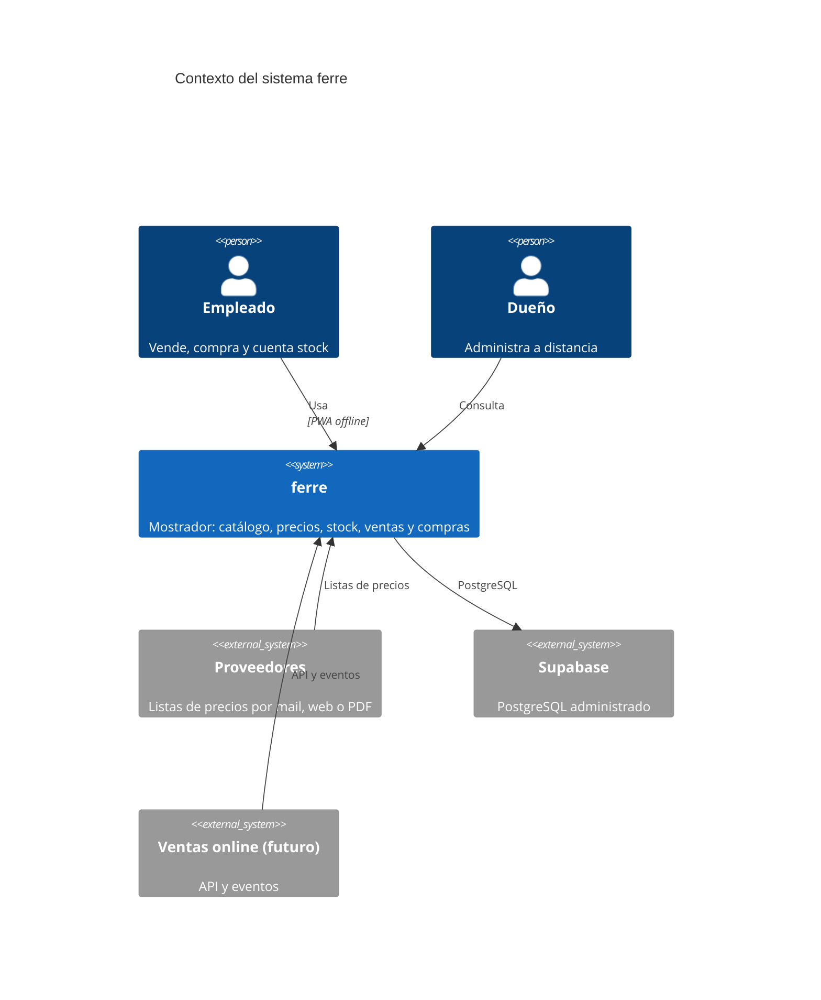
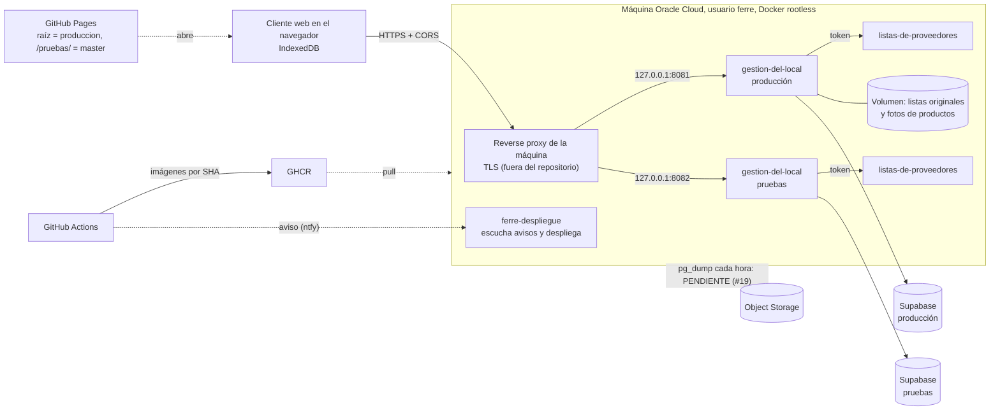

# Implementation Plan: Base del sistema

**Branch**: `001-base-del-sistema` | **Date**: 2026-10-10 | **Spec**: [spec.md](spec.md)

**Input**: Feature specification from `/specs/001-base-del-sistema/spec.md`

**Note**: Línea de base. No planifica trabajo nuevo: describe la arquitectura ya construida.
Viene de `docs/ARCHITECTURE.md`, `docs/SECURITY.md` y `docs/adr/`, contrastados con el
código y la configuración el 2026-10-10. Donde el documento de origen y el código no
coincidían, acá está lo que dice el código y la diferencia queda anotada.

## Summary

Sistema de gestión para una ferretería de barrio: un local, un empleado, ~50 proveedores con
listas en Excel, ventas que hoy se anotan en un cuaderno. Reemplaza el cuaderno sin retrasar
al empleado, mantiene los precios al día sin cargarlos a mano, registra stock, ventas y
compras, y deja que el dueño administre a distancia.

La forma técnica: un cliente web que funciona sin conexión (PWA con IndexedDB), publicado
aparte del servidor; una API dueña de la base; un servicio sin estado que lee las listas de
los proveedores; PostgreSQL administrado; todo en infraestructura gratuita.

## Technical Context

**Language/Version**: TypeScript 5.6 sobre Node 22 (API, cliente web, librería de precios); Python 3.12 (lector de listas).

**Primary Dependencies**: Hono 4 y `pg` (API); React 18, Vite 5 y `vite-plugin-pwa` (cliente); `@simplewebauthn` y `google-auth-library` (entrada); `@zxing` (lector de códigos con la cámara); FastAPI y openpyxl (listas). pnpm 10 y uv como gestores (ADR-008).

**Storage**: PostgreSQL, usado por cadena de conexión: Supabase en pruebas y producción, `postgres:17-alpine` del compose en desarrollo y CI. IndexedDB en el dispositivo (catálogo, stock, clientes, ventas de 7 días, cola de cambios). Un volumen de archivos en la máquina, montado en la API: los Excel originales de las listas y las fotos de productos.

**Testing**: vitest (unitarias TypeScript, con base simulada y jsdom + IndexedDB simulada), pytest (listas), scripts bash (integración), Playwright sobre Chromium (punta a punta, una vez por interfaz). Detalle en [quickstart.md](quickstart.md).

**Target Platform**: servidor Linux arm64 (Oracle Cloud Always Free, Ampere) con Docker rootless; cliente en Chrome o Firefox de una notebook vieja y en el navegador de un celular Android.

**Project Type**: aplicación web: dos servicios, un cliente y una librería compartida en un workspace.

**Performance Goals**: buscar y cambiar un margen en menos de 100 ms; guardar una venta en el dispositivo en menos de 50 ms.

**Constraints**: buscar y vender funcionan sin conexión; cero pérdida de ventas; costo de infraestructura cero; nada se instala en la notebook; configuración sin valores por omisión.

**Scale/Scope**: tres usuarios y unas 200 ventas por día; cuatro proveedores cargados de unos 50; el catálogo puede superar los 100.000 artículos (sin probar a ese volumen, RNF-08).

## Constitution Check

*GATE: la línea de base no pasa por la compuerta; se anota cómo queda lo construido frente a cada principio.*

| Principio | Cómo queda lo construido |
|---|---|
| I. La especificación manda | Lo construido es anterior al método; esta carpeta y las `002` a `007` pasan a ser su especificación |
| II. La vara es el cuaderno y la calculadora | La búsqueda en menos de 100 ms está medida con 50.000 productos; el cambio de margen no está medido. La venta en menos de 20 segundos queda a validar en el piloto (#21) |
| III. Dos interfaces, una app | Cumple: dos árboles de pantallas elegidos por el ancho (900 px), cada uno con sus estilos y sus escenarios de punta a punta |
| IV. Sin internet no se nota y no se pierde nada | Cumple para ventas, «no llevó», márgenes, ajustes de stock y conteos. Un cambio que el servidor rechaza por inválido se descarta de la cola (ver Edge Cases de la spec) |
| V. Nada se borra y todo número se explica | Cumple, con dos excepciones: unir productos mueve filas de los históricos, y los renglones de un conteo abierto se borran (ver [data-model.md](data-model.md)) |
| VI. Primero la prueba, y «hecho» solo con evidencia | No cumple todavía: 20 de los 49 escenarios de esta carpeta no tienen prueba. Las unitarias corren en cada push; las de punta a punta, a mano y los lunes |
| VII. Seguro por defecto | Cumple en lo que está en el repositorio. TLS y Docker rootless los pone la máquina, fuera del repositorio |
| VIII. Disponibilidad antes que escala, y costo cero | Cumple. De las cuatro capas de respaldo de ADR-002 solo está la primera (el dispositivo); las otras tres están pendientes (#19) |
| IX. En castellano y con las palabras del mostrador | Cumple |
| X. Toda decisión queda escrita | Cumple: 14 ADR. Varios documentos estaban atrasados respecto del código (ver «Diferencias encontradas») |

## Project Structure

### Documentation (this feature)

```text
specs/001-base-del-sistema/
├── spec.md          # Requerimientos no funcionales construidos y sus escenarios
├── plan.md          # Este archivo: arquitectura, seguridad, ADR
├── data-model.md    # Modelo de datos completo, contrastado con las migraciones
├── quickstart.md    # Cómo se levanta y cómo se prueba
└── tasks.md         # Los issues cerrados de base e infraestructura
```

### Source Code (repository root)

```text
microservices/gestion-del-local/       Lo que pasa dentro del local: catálogo, precios, ventas, cuenta corriente, compras, stock (Hono, TypeScript)
├── migrations/                        Esquema de la base, un archivo SQL por cambio
└── src/                               rutas/, autenticación, sesiones, eventos, migraciones
microservices/listas-de-proveedores/   Recibe listas de proveedores y las convierte en precios (FastAPI, Python)
└── listas_de_proveedores/lectores/    Un lector por proveedor: comodo, erpa, ixnova, tresge
clientes/gestion-del-local-web/        Pantalla del empleado y del dueño (React, PWA, GitHub Pages)
└── src/
    ├── App.tsx, pantallas/, componentes/, estilos.css   Interfaz de celular
    ├── escritorio/                                      Interfaz de computadora
    └── almacen.ts, cola.ts, catalogo.ts, api.ts, sesion.tsx, vista.ts, ambiente.ts   Lo compartido
libraries/calculo-de-precios/          Costo, margen y precio con su explicación; búsqueda (compartida)
infrastructure/reverse-proxy/          Caddy, solo para desarrollo
deployment/oracle-single/              Plantillas de configuración y despliegue en Oracle Cloud
tests/                                 Corredores: utest.sh, itest.sh, e2e.sh; integration/; e2e/escritorio y e2e/celular
docs/                                  ADR, despliegue, seguridad, sistema visual
```

**Structure Decision**: servicios, clientes y librerías en carpetas propias, nombradas por la
parte del negocio que resuelven, con un workspace de pnpm en la raíz que enlaza la librería
compartida (ADR-010).

## Contexto



Fuente: `docs/diagrams/contexto.mmd`. Hoy las listas entran solo como Excel que alguien
sube; mail, web y PDF están pendientes (#25, #26, #27). Google no figura en el diagrama de
origen y es una dependencia externa: confirma la identidad en el primer ingreso de cada
dispositivo (ADR-011).

## Componentes

| Componente | Qué hace | Tecnología | ADR |
|---|---|---|---|
| `microservices/gestion-del-local` | Lo que pasa dentro del local: catálogo y precios, ventas, cuenta corriente, compras, stock. Dueño de la base | Node 22, Hono, TypeScript | 001, 010 |
| `clientes/gestion-del-local-web` | Las pantallas, en dos interfaces que comparten todo lo demás: tarjetas para el celular y tablas con teclado para la computadora (014); funciona sin internet con IndexedDB; publicada en GitHub Pages | React, Vite, PWA | 005, 010 |
| `libraries/calculo-de-precios` | Costo neto, margen y precio con su explicación; compartida entre servicio y cliente | TypeScript | 001 |
| `microservices/listas-de-proveedores` | Recibe listas de proveedores y las convierte en precios. Hoy lee Excel de cuatro proveedores | Python 3.12, FastAPI, openpyxl | 001 |
| `infrastructure/reverse-proxy` | Caddy del compose, perfil `gateway`: sirve la API en `http://localhost` en desarrollo y CI. En la máquina de Oracle no se usa: ahí el reverse proxy con TLS lo administra la máquina, fuera de este repositorio | Caddy | 006, 013 |
| Base de datos | PostgreSQL administrado, usado por cadena de conexión | Supabase | 002 |

## Límites y comunicación

- `gestion-del-local` es el único dueño de la base de datos. Ningún otro servicio la toca
  (ADR-003).
- `gestion-del-local` llama a `listas-de-proveedores` por HTTP con un token de servicio
  compartido (`TOKEN_SERVICIO`, cabecera `X-Token-Servicio`), que el otro servicio verifica
  en cada llamada. `listas-de-proveedores` no tiene estado ni base y solo es alcanzable en
  la red del compose.
- El cliente web vive en otro origen (GitHub Pages) y habla con la API con CORS, restringido
  a `ORIGEN_WEB`, y un token de sesión en la cabecera `Authorization` (ADR-010).
- Los eventos de dominio se guardan en una tabla de eventos en JSON versionado. Hoy los
  consume la propia app (auditoría); un futuro servicio de ventas online los lee desde ahí.
- El cliente web es una PWA: un service worker precachea la app entera, así abre sin
  conexión y se actualiza sola. Catálogo, stock, clientes, ventas de 7 días y la cola única
  de cambios pendientes viven en IndexedDB (`almacen.ts`, `cola.ts`). Todo cambio del
  mostrador se anota primero en la cola y recién después se manda, en orden: una recarga con
  el pedido en vuelo no lo pierde, sin red queda esperando y sale al reconectar (al evento
  de reconexión y, por si no llega, una vez por minuto). La API y Google nunca pasan por el
  caché.
- La API expone `/health` (200 con la base respondiendo, 503 sin ella), que usan el
  healthcheck del compose y el despliegue.

## Despliegue



- **Ramas y ambientes:** `master` es pruebas y `produccion` es producción. Pasar a
  producción es `git push origin master:produccion`; revertir es desplegar el SHA anterior
  (ADR-012).
- **En cada push** a una de las dos ramas, CI corre las unitarias y las verificaciones
  rápidas, construye las imágenes en un runner ARM y las publica en GHCR etiquetadas con el
  SHA corto, publica el cliente web en Pages (las dos carpetas) y manda un aviso por ntfy
  (ADR-007, ADR-013).
- **La máquina se despliega sola:** el servicio `ferre-despliegue` (unidad de usuario de
  systemd) escucha el aviso, consulta a GitHub qué commit tiene cada rama, comprueba que la
  imagen exista en GHCR, baja el compose de ese commit y levanta. Verifica la salud por los
  healthchecks; si la versión nueva no queda sana, vuelve a la anterior. Toma un lock para
  no solaparse. Nada externo ejecuta nada en la máquina (ADR-013).
- **Dos proyectos de compose** en la misma máquina, con el mismo `docker-compose.yml` y un
  `.env` cada uno. Cada API se publica solo en `127.0.0.1` (8081 producción, 8082 pruebas);
  el proxy de la máquina, que no es parte de este proyecto, apunta ahí (ADR-013, enmienda 2).
- **Configuración:** un solo compose; lo que cambia entre ambientes sale del `.env`, sin
  valores por omisión; lo que solo existe en un ambiente va con perfiles (`local`: base
  propia; `gateway`: Caddy de desarrollo) (ADR-009).
- **Lo único con estado en la máquina** es el volumen de cada ambiente con los Excel
  originales de las listas y las fotos de productos. La base está en Supabase.
- **Primer usuario:** se crea desde el contenedor
  (`docker compose exec gestion-del-local node dist/crear-usuario.js correo "Nombre" dueño`);
  los siguientes, desde la app.

Detalle en `docs/operacion/DEPLOYMENT.md` y `deployment/oracle-single/ORACLE.md`.

## Modelo de datos

En [data-model.md](data-model.md): tablas, reglas comunes y cómo se migra el esquema.

## Seguridad

### Qué se protege

Datos de ventas, compras, costos y márgenes del negocio; listas de precios de proveedores
(información de terceros); acceso al mostrador.

### Amenazas y mitigaciones

El estado es el verificado en el código el 2026-10-10; donde difiere de `docs/SECURITY.md`
está dicho.

| Amenaza | Mitigación | Estado |
|---|---|---|
| Datos sensibles en el repo público | `privado/` y todo `.xlsx`/`.pdf`/`.env` en `.gitignore` (salvo las muestras anonimizadas de las pruebas); plantillas con marcadores | Hecho (#1) |
| Secretos en imágenes o código | Toda configuración sale del `.env`; el `.dockerignore` excluye `.env*` y `privado` | Hecho |
| Variable de seguridad olvidada que deja algo abierto | Sin valores por omisión: el arranque falla (ADR-009); prueba de paridad | Hecho |
| Servicios internos expuestos a internet | La API se publica solo en `127.0.0.1` y sale por el proxy de la máquina; `listas-de-proveedores` solo es alcanzable en la red del compose. El documento de origen decía «solo Caddy publica puertos», que vale para desarrollo | Hecho |
| Cualquier sitio llamando a la API desde un navegador | CORS restringido a `ORIGEN_WEB` | Hecho |
| Llamadas entre servicios sin autenticar | `TOKEN_SERVICIO` compartido, verificado en cada llamada interna | Hecho: el documento de origen lo daba «Pendiente (#7)», pero está en el código y tiene su prueba (`microservices/listas-de-proveedores/tests/test_api.py`) |
| Acceso al mostrador sin usuario | Entrada con Google o con la huella del celular (sin contraseñas), sesiones opacas revocables, roles dueño/admin/mostrador (el admin administra pero no toca dueños), límite de intentos por IP (ADR-011) | Hecho (#41) |
| No saber quién hizo qué | Cada evento lleva el usuario; se consulta de a 10 por página | Hecho en parte (#41): faltan los filtros (#58). El documento de origen decía «lo consulta filtrado» |
| Robo del token de sesión del dispositivo | Token hasheado en la base; revocación desde la app; 90 días renovables | Hecho (#41) |
| Tráfico en claro | HTTPS obligatorio: el cliente en GitHub Pages y la API detrás del proxy de la máquina; la PWA y la huella no funcionan sin él | Hecho (#38); el TLS de la API está fuera del repositorio |
| Pérdida de datos | Cuatro capas de respaldo (ADR-002) | Hecho en parte: la primera capa, el dispositivo, está (#18); el volcado horario, la copia semanal y la prueba de restauración están pendientes (#19) |
| Contenedor corriendo como root | Usuario sin privilegios con uid fijo en ambos Dockerfiles; en la máquina, Docker rootless | Hecho |

### Qué queda abierto

- Passkeys: la clave privada nunca sale del teléfono; la API guarda la pública y un contador
  que detecta clonado. Quien tenga el teléfono desbloqueado y el dedo del dueño entra;
  mitigación: quitar el celular desde Administración desde otro dispositivo.
- Las fotos de productos (`/fotos/<uuid>.jpg`) se sirven sin sesión: una etiqueta `` no
  puede mandar el token. El nombre al azar impide adivinarlas y son fotos de mercadería, no
  datos.
- Quien tenga acceso físico al navegador desbloqueado de la laptop opera como el usuario
  logueado. Mitigación: cerrar sesión al terminar el día o revocarla desde el celular.
- El plan gratuito de Supabase no tiene garantía de servicio ni respaldos propios: el
  respaldo es responsabilidad nuestra, y todavía no está hecho (#19).
- El token de sesión vive en `localStorage` del navegador, no en una cookie `HttpOnly`,
  porque cliente y API están en orígenes distintos (ADR-010, ADR-011).

## Decisiones (ADR)

Todas en `docs/adr/`. Las que más condicionan el diseño: el stack offline-first (001), la
base en Supabase con la máquina sin estado (002) y los límites del microservicio (003).

| Nº | Título | Qué decide |
|---|---|---|
| 001 | TypeScript para API y PWA, Python para el importador | API en Node con Hono; cliente React con Vite como PWA que funciona sin conexión; el cálculo de precios en una librería TypeScript compartida entre API y navegador; el lector de listas en Python, como servicio aparte. Único requisito del cliente: un navegador actualizado |
| 002 | PostgreSQL administrado en Supabase, máquina de Oracle sin estado, volcado horario y prueba de restauración | La base sale de la máquina gratuita y se usa como PostgreSQL común, sin el SDK de Supabase. Cuatro capas contra la pérdida de datos: el dispositivo (con 7 días de ventas confirmadas), volcado horario con 30 días de retención, copia semanal cifrada afuera y prueba mensual de restauración; más un monitor externo. Solo la primera capa está construida |
| 003 | Este repo es el microservicio de mostrador; se integra por API y eventos | Dos servicios en el repo; la API es la única puerta a los datos; los eventos de dominio van a una tabla en JSON versionado; ids UUID generados en el cliente; token de servicio entre servicios |
| 004 | E2E de los caminos principales; sin compuerta de cobertura ni mutation testing | Punta a punta para los caminos principales, unitarias donde aceleran, integración solo sobre lo estable. Enmienda 2026-09-14: las unitarias corren en cada push y las de punta a punta se lanzan a mano y una vez por semana; cada pedido del dueño que cambia un comportamiento trae su unitaria |
| 005 | IndexedDB directo con un wrapper propio, sin Dexie | La capa sin conexión es un módulo propio sobre IndexedDB, que se puede probar sin navegador |
| 006 | Caddy como reverse proxy con TLS automático | Caddy en el compose con el dominio tomado del `.env`. Desde ADR-013 queda solo para desarrollo |
| 007 | Las imágenes se construyen en CI y se publican en GHCR | CI construye después de las pruebas y publica las dos imágenes etiquetadas con el SHA corto; la máquina solo descarga; revertir es cambiar el SHA |
| 008 | pnpm para TypeScript y uv para Python | pnpm 10 fijado con `packageManager`; uv con `uv.lock` versionado; los Dockerfiles instalan con el lockfile congelado |
| 009 | Un solo docker-compose.yml con el .env como única fuente | Un compose para todos los ambientes; perfiles para lo que existe en uno solo; ninguna variable con valor por omisión; prueba de paridad entre los `.env` |
| 010 | Servicios, clientes y librerías separados; nombres por negocio; cliente web en GitHub Pages | La estructura de carpetas y la regla de nombres; workspace de pnpm en la raíz; el cliente se publica en Pages y habla con la API por CORS con la sesión en cabecera; Caddy sirve solo la API |
| 011 | Entrar con Google o con la huella, sesiones opacas revocables, auditoría por usuario | Identidad confirmada por Google contra la tabla de usuarios autorizados; sesión de 90 días renovable, guardada hasheada; límite de intentos por IP. Enmiendas: passkeys para entrar con la huella del celular (2026-09-14), rol admin (2026-09-14), se quita el login por QR (2026-10-09), y los tres roles Administrador, Vendedor y Comprador reemplazarán a los actuales con #59 (2026-10-09) |
| 012 | Dos ambientes en la misma máquina, promoción por rama, despliegue desde CI | `master` es pruebas y `produccion` es producción; dos proyectos de compose, dos bases, un sitio de Pages con dos carpetas; imágenes en un runner ARM. El despliegue por SSH desde CI fue reemplazado por ADR-013 |
| 013 | La máquina se despliega sola al recibir un aviso; Caddy compartido como puerta de entrada | CI avisa por ntfy y la máquina verifica contra GitHub y GHCR y despliega, con vuelta atrás si no queda sana. Enmiendas del mismo día: el reverse proxy sale del repositorio y lo administra la máquina; todo corre como un usuario sin privilegios con Docker rootless; la API se publica en un puerto de la interfaz local en vez de una red compartida |
| 014 | Dos interfaces sobre la misma app: tarjetas para el celular, tablas y teclado para la computadora; se elige por el ancho | Dos árboles de pantallas en el mismo cliente, elegidos al abrir por el ancho (900 px), cada uno con sus estilos; lo que no es pantalla se comparte. Toda función nueva con pantalla se hace dos veces |

## Diferencias encontradas entre los documentos de origen y el código

| Documento | Dice | El código o la configuración |
|---|---|---|
| `docs/ARCHITECTURE.md` y `docs/diagrams/despliegue.mmd` | Caddy del compose dentro de la máquina, como «TLS automático y única puerta de entrada» | En la máquina el proxy es de la máquina, fuera del repositorio; el Caddy del compose es solo de desarrollo (`docker-compose.yml`, ADR-013 enmiendas) |
| Los mismos y `docs/DEPLOYMENT.md` | `pg_dump` cada hora a Object Storage, copia semanal y prueba mensual, en presente | No hay ningún script ni tarea de respaldo en el repositorio; es #19, abierto |
| `docs/diagrams/despliegue.mmd` | Un solo ambiente | Dos, uno por rama (ADR-012) |
| `docs/SECURITY.md` | Token de servicio «Pendiente (#7)»; pérdida de datos «Pendiente (#18, #19)»; «solo Caddy publica puertos»; auditoría «filtrada» | Ver la tabla de amenazas |
| ADR-002 y `docs/ARCHITECTURE.md` | La máquina no tiene estado: «ningún dato vive ahí» | Los Excel originales de las listas y las fotos de productos se guardan en un volumen de Docker de la máquina (`listas-data`, `rutas/productos.ts`), uno por ambiente, sin copia |
| ADR-001 y ADR-003 | La API está documentada con OpenAPI | No hay ningún documento OpenAPI en el repositorio |
| ADR-010 | El token de sesión vive en IndexedDB | Vive en `localStorage` (`api.ts`), como dice ADR-011 |
| ADR-007 | El job de imágenes corre después de los E2E | Corre después de las unitarias y las verificaciones rápidas (`ci.yml`, ADR-004 enmienda) |
| `docs/DEPLOYMENT.md` | «El script de despliegue, el preflight y la guía se generan en el issue #19» | Ya existen en `deployment/oracle-single/` |
| ADR-003 | Los eventos alimentan la sincronización de la PWA | La sincronización es la cola del cliente que reenvía pedidos HTTP; los eventos se usan para auditoría |
| Repositorio | — | `microservices/gestion-del-local/public/` conserva un cliente compilado de antes de ADR-010 que nada sirve |

## Complexity Tracking

Sin violaciones que justificar: es la línea de base.
