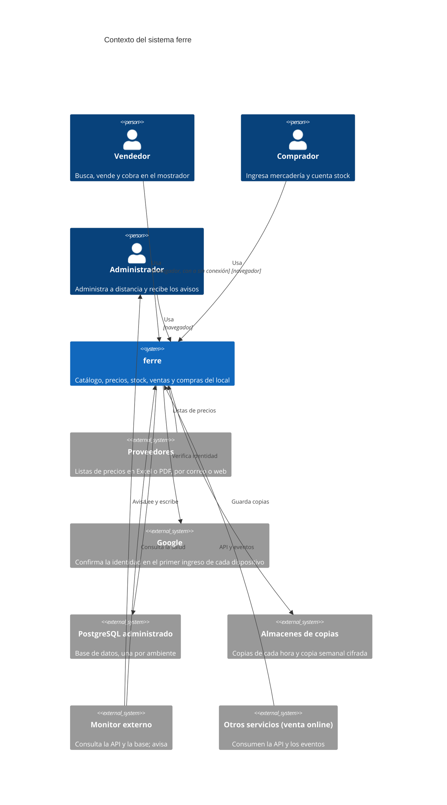
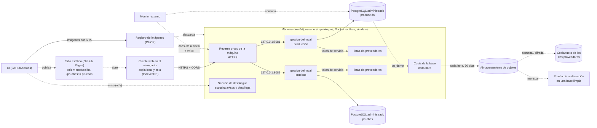

# Implementation Plan: Base del sistema

**Branch**: `001-base-del-sistema` | **Date**: 2026-10-10 | **Spec**: [spec.md](spec.md)

**Input**: Feature specification from `/specs/001-base-del-sistema/spec.md`

**Note**: Este plan es la arquitectura decidida en los ADR (`docs/adr/`). Es el contrato
técnico que tiene que respetar cualquier servidor o cualquier pantalla que se construya,
se rehaga o se sume. No dice cuánto de esto existe: eso se anota fuera de `specs/`.

## Summary

Sistema de gestión para una ferretería de barrio: un local, un mostrador, unos 50
proveedores con listas de precios en Excel y PDF. Reemplaza el cuaderno de ventas sin
retrasar al Vendedor, mantiene los precios al día sin cargarlos a mano, registra stock,
ventas y compras, y deja que el Administrador administre a distancia.

La forma técnica: un cliente web que funciona sin conexión, publicado aparte del servidor;
una API dueña de la base y única puerta a los datos; un servicio sin base propia que lee las
listas de los proveedores; PostgreSQL administrado fuera de la máquina; una máquina que no
guarda datos; cuatro capas de respaldo y un monitor externo; todo en infraestructura
gratuita.

## Technical Context

**Language/Version**: TypeScript sobre Node (API, cliente web, librería de precios); Python (servicio de listas). Otra elección de lenguaje necesita su ADR (ADR-001, RNF-51).

**Primary Dependencies**: Hono (API); React con Vite, como PWA con service worker (cliente); Google Identity Services y WebAuthn (entrada, ADR-011); openpyxl, pandas y pdfplumber (listas, ADR-001). Gestores: pnpm 10 y uv, con sus lockfiles versionados (ADR-008).

**Storage**: PostgreSQL usado por cadena de conexión, sin SDK ni productos del proveedor (ADR-002). En el dispositivo, IndexedDB detrás de un módulo propio (ADR-005): catálogo, stock, clientes, ventas de 7 días y cola de cambios. Copias de la base en un almacenamiento de objetos y, cifradas, fuera de los dos proveedores (ADR-002).

**Testing**: unitarias en cada push; integración sobre lo estable; punta a punta de los caminos principales, una vez por interfaz, a mano y una vez por semana (ADR-004). Detalle en [quickstart.md](quickstart.md).

**Target Platform**: servidor Linux arm64 con Docker rootless (ADR-012, ADR-013); cliente en Chrome o Firefox actualizados de una notebook vieja y en el navegador de un celular Android (ADR-001).

**Project Type**: aplicación web: dos servicios, un cliente y una librería compartida en un workspace (ADR-010).

**Performance Goals**: buscar y cambiar un margen en menos de 100 ms; guardar una venta en el dispositivo en menos de 50 ms; con 50.000 productos y 10.000 ventas en el dispositivo (RNF-07). Búsqueda en menos de 100 ms con más de 100.000 artículos (RNF-08).

**Constraints**: buscar y vender funcionan sin conexión; cero ventas perdidas; costo de infraestructura cero; nada se instala en la notebook; configuración sin valores por omisión; la máquina no guarda datos.

**Scale/Scope**: tres usuarios y unas 200 ventas por día; unos 50 proveedores; el catálogo puede superar los 100.000 artículos.

## Constitution Check

*GATE: cómo responde la arquitectura a cada principio de la constitución.*

| Principio | Qué lo sostiene en la arquitectura |
|---|---|
| I. La especificación manda y no depende del código | La API documentada y el modelo de datos son el contrato; servidor y pantallas se pueden rehacer por separado contra él |
| II. La vara es el cuaderno y la calculadora | Búsqueda y cálculo de precios corren en el dispositivo, sin esperar al servidor (ADR-001, ADR-005) |
| III. Dos interfaces, una app | Dos árboles de pantallas en el mismo cliente, elegidos por el ancho (900 px), cada uno con sus estilos; lo que no es pantalla se comparte (ADR-014) |
| IV. Sin internet no se nota y no se pierde nada | Cliente publicado fuera de la máquina; copia local y cola de cambios en el dispositivo; ids generados en el cliente y escrituras que se pueden repetir sin duplicar (ADR-001, ADR-003, ADR-005, ADR-010) |
| V. Nada se borra y todo número se explica | Históricos que solo reciben filas; tabla de eventos con el usuario; el cálculo de precios devuelve siempre su explicación (ADR-001, ADR-003) |
| VI. Primero la prueba, y evidencia para dar algo por cumplido | Unitarias como compuerta de cada publicación; punta a punta por interfaz (ADR-004) |
| VII. Seguro por defecto | Configuración solo por `.env` y sin valores por omisión; sesiones opacas revocables sin contraseñas; HTTPS; usuario sin privilegios y ningún puerto a internet (ADR-009, ADR-011, ADR-013) |
| VIII. Disponibilidad antes que escala, y costo cero | Una sola máquina sin estado, base administrada gratuita, cuatro capas de respaldo y monitor externo (ADR-002) |
| IX. En castellano y con las palabras del mostrador | Servicios, clientes y librerías se nombran por la parte del negocio que resuelven (ADR-010) |
| X. Toda decisión queda escrita | Los ADR de la tabla del final; las decisiones posteriores entran como enmienda |

## Project Structure

### Documentation (this feature)

```text
specs/001-base-del-sistema/
├── spec.md          # Requerimientos no funcionales y sus escenarios
├── plan.md          # Este archivo: arquitectura decidida, seguridad, ADR
├── data-model.md    # Modelo de datos del servidor
└── quickstart.md    # Cómo se levanta y cómo se prueba
```

### Source Code (repository root)

La estructura y los nombres los fija ADR-010.

```text
microservices/gestion-del-local/       Lo que pasa dentro del local: catálogo y precios, ventas, cuenta corriente, compras, stock. Dueño de la base y de sus migraciones
microservices/listas-de-proveedores/   Recibe listas de proveedores por cualquier canal y las convierte en precios
clientes/gestion-del-local-web/        Las pantallas, en sus dos interfaces. Se publica como sitio estático
libraries/calculo-de-precios/          Costo, margen y precio, siempre con su explicación; búsqueda. Compartida entre servidor y cliente
infrastructure/reverse-proxy/          Proxy para desarrollo y CI
deployment/                            Plantillas de configuración por ambiente y despliegue en la máquina
tests/                                 Corredores de unitarias, integración y punta a punta (una carpeta por interfaz)
docs/                                  ADR, operación, sistema visual, decisiones de negocio
```

**Structure Decision**: servicios, clientes y librerías en carpetas propias, nombradas por
la parte del negocio que resuelven y nunca por su rol técnico («backend», «api», «web»,
«app»). Un cliente se llama por el servicio que muestra más la plataforma
(`gestion-del-local-android`). Un workspace de pnpm en la raíz enlaza la librería
compartida; cada servicio se empaqueta solo con lo suyo (ADR-010).

## Contexto



## Componentes

| Componente | Responsabilidad | Tecnología | ADR |
|---|---|---|---|
| `gestion-del-local` | Todo lo que pasa dentro del local: catálogo y precios, ventas, cuenta corriente, compras, stock, usuarios y sesiones. Dueño de la base y de sus migraciones. Expone la API | Node, Hono, TypeScript | 001, 003, 010, 011 |
| `listas-de-proveedores` | Recibe una lista de un proveedor y devuelve filas normalizadas. Sin base y sin estado | Python | 001, 003 |
| `gestion-del-local-web` | Las pantallas, en dos interfaces que comparten todo lo que no es pantalla: tarjetas y pestañas para el celular, tablas y teclado para la computadora. Funciona sin conexión | React, Vite, TypeScript, PWA | 001, 005, 010, 014 |
| `calculo-de-precios` | Costo neto, margen y precio de venta, que devuelve siempre con su explicación paso a paso; búsqueda. El mismo código corre en el servidor y en el dispositivo | TypeScript | 001, 010 |
| Base de datos | PostgreSQL administrado, uno por ambiente, usado por cadena de conexión | PostgreSQL | 002 |
| Reverse proxy | Termina HTTPS y deriva a la API de cada ambiente. En la máquina lo administra la máquina, fuera del repositorio; el del repositorio es solo para desarrollo y CI | Caddy | 006, 013 |
| Servicio de despliegue | Corre en la máquina; escucha el aviso, verifica y despliega cada ambiente | Unidad de usuario de systemd | 013 |
| Respaldos | Copia de la base cada hora, copia semanal cifrada afuera, prueba mensual de restauración | `pg_dump`, almacenamiento de objetos | 002 |
| Monitor externo | Consulta la API y la base desde fuera de la máquina; avisa a los Administradores | Servicio externo gratuito | 002 |

## Límites y comunicación

- **La API es la única puerta a los datos.** `gestion-del-local` es el único dueño de la
  base; ningún otro servicio ni cliente la toca (ADR-003).
- **La API está documentada con OpenAPI.** Ese documento, junto con
  [data-model.md](data-model.md), es el contrato entre el servidor y cualquier pantalla
  (ADR-001, ADR-003).
- **Entre servicios, token de servicio.** `gestion-del-local` llama a
  `listas-de-proveedores` por HTTP con un token compartido que el otro verifica en cada
  llamada. `listas-de-proveedores` solo es alcanzable en la red interna de su ambiente
  (ADR-003).
- **Cliente y API en orígenes distintos.** La API habilita CORS solo para el origen del
  cliente, que sale de la configuración. La sesión viaja en la cabecera `Authorization`,
  nunca en una cookie (ADR-010, ADR-011).
- **Ids generados en el cliente.** Todo documento (venta, compra, ajuste, conteo) nace con
  un UUID puesto por quien lo crea, así un pedido reenviado no se duplica y uno creado sin
  conexión no choca (ADR-003).
- **Eventos de dominio.** Toda acción que cambia datos escribe un evento en una tabla, en
  JSON versionado y con el usuario que la hizo. Los consume la auditoría («quién hizo
  qué»); un servicio futuro los lee desde ahí. El broker se elige cuando haya un segundo
  consumidor (ADR-003).
- **El cliente es una PWA.** Un service worker guarda la app entera en el dispositivo: abre
  sin conexión y toma sola la versión nueva. Las respuestas de la API y de Google nunca se
  sirven desde ese guardado (ADR-001).
- **Copia local y cola de cambios.** El dispositivo guarda en IndexedDB el catálogo con sus
  costos y márgenes, el stock, los clientes, las ventas de los últimos 7 días y una cola
  única de cambios. Todo cambio del mostrador se anota primero en la cola y recién después
  se manda, en orden: una recarga con el pedido en vuelo no lo pierde, sin red queda
  esperando y sale al reconectar y, por si ese aviso del navegador no llega, una vez por
  minuto. Un cambio sale de la cola cuando la API lo confirma (ADR-001, ADR-002, ADR-005).
- **La capa sin conexión es un módulo propio** sobre IndexedDB, con una interfaz que se
  puede probar sin navegador (ADR-005).
- **Salud.** Cada servicio expone `/health`. El de la API responde 200 con la base
  respondiendo y 503 sin ella. Lo usan el control de salud de los contenedores, el
  despliegue y el monitor.
- **Esquema.** La API aplica las migraciones al arrancar, antes de atender
  ([data-model.md](data-model.md)).

## Despliegue



- **Ramas y ambientes:** `master` es pruebas y `produccion` es producción. No son ramas de
  trabajo: apuntan a lo que está vivo en cada ambiente. Pasar a producción es
  `git push origin master:produccion`; revertir es desplegar el SHA anterior (ADR-012).
- **En cada push** a una de las dos ramas, CI corre las unitarias y las verificaciones de
  configuración. Si pasan, construye las imágenes en un runner ARM y las publica en el
  registro etiquetadas con el SHA corto, publica el cliente web en el sitio estático
  (producción en la raíz, pruebas en `/pruebas/`) y manda un aviso por ntfy (ADR-004
  enmienda, ADR-007, ADR-012, ADR-013).
- **La máquina se despliega sola:** un servicio propio mantiene una conexión saliente al
  canal de avisos. Por cada aviso consulta al repositorio qué commit tiene cada rama,
  comprueba que la imagen de ese commit esté en el registro, baja la definición de
  servicios de ese commit y levanta. Verifica la salud; si la versión nueva no queda sana,
  vuelve a la anterior. Toma un lock para no solaparse. También corre al arrancar la
  máquina y a mano. El aviso no lleva información y nada externo ejecuta nada en la máquina
  (ADR-013).
- **Dos proyectos de compose** en la misma máquina, con el mismo `docker-compose.yml` y un
  `.env` cada uno. Cada API se publica solo en `127.0.0.1` (8081 producción, 8082 pruebas);
  el proxy de la máquina apunta ahí (ADR-012, ADR-013 enmienda 2).
- **Configuración:** un solo compose; lo que cambia entre ambientes sale del `.env`, sin
  valores por omisión, y un servicio sin alguna de sus variables no arranca; lo que solo
  corre en un ambiente va con perfiles activados desde el `.env`. Una prueba de paridad
  comprueba que todas las plantillas declaren las mismas variables (ADR-009).
- **Cliente web:** se construye con el origen de la API y la ruta base del sitio; sin el
  origen de la API el build se corta (ADR-010).
- **La máquina no guarda datos:** si desaparece, el mismo compose se levanta en otra sin
  perder nada (ADR-002). Dónde viven los archivos que no son filas de la base (los Excel
  originales de las listas y las fotos de productos) no está decidido en ningún ADR: es
  una pregunta de [spec.md](spec.md), RNF-21, y lo que se decida va en un ADR nuevo.
- **Respaldos (ADR-002):** `pg_dump` cada hora desde la máquina a un almacenamiento de
  objetos, con 30 días de retención; copia semanal cifrada fuera del proveedor de la
  máquina y del de la base; prueba mensual automática de restauración en una base limpia,
  comparando cantidad de ventas y total facturado con la base viva.
- **Monitor externo (ADR-002):** consulta la base a diario, lo que evita la pausa por
  inactividad del plan gratuito, y avisa si la API o la base no responden. Alerta al
  superar 350 MB.
- **Primer usuario:** se crea con un comando en el contenedor de la API; los siguientes,
  desde la app (ADR-011).

La operación paso a paso está en `docs/operacion/`.

## Modelo de datos

En [data-model.md](data-model.md): tablas, reglas comunes y cómo se migra el esquema.

## Seguridad

### Qué se protege

Datos de ventas, compras, costos y márgenes del negocio; listas de precios de proveedores
(información de terceros); acceso al mostrador.

### Amenazas y mitigación exigida

| Amenaza | Mitigación exigida | Decisión |
|---|---|---|
| Datos sensibles en el repositorio, que es público | La carpeta de datos privados, toda planilla, todo PDF y todo `.env` real quedan fuera del control de versiones; solo entran muestras anonimizadas y plantillas con marcadores | Constitución VII, RNF-43 |
| Secretos en imágenes o en código | Toda configuración sale del `.env`; las imágenes se construyen sin `.env` ni datos privados. Las imágenes publicadas son públicas | ADR-007, ADR-009 |
| Variable de seguridad olvidada que deja algo abierto | Sin valores por omisión: sin la variable el arranque falla; prueba de paridad entre plantillas | ADR-009 |
| Servicios expuestos a internet | La API se publica solo en `127.0.0.1` y sale por el proxy de la máquina; `listas-de-proveedores` solo es alcanzable en la red interna de su ambiente; ningún puerto de administración abierto a internet | ADR-013 |
| Alguien externo ejecuta comandos en la máquina | El despliegue lo hace la máquina: sin claves de acceso a la máquina en CI, sin agente de CI en la máquina. Solo se despliega lo que dicen las ramas del repositorio y las imágenes por SHA del registro | ADR-013 |
| Cualquier sitio llamando a la API desde un navegador | CORS restringido al origen del cliente | ADR-010 |
| Llamadas entre servicios sin autenticar | Token de servicio compartido, verificado en cada llamada interna | ADR-003 |
| Acceso al mostrador sin usuario | Entrada con Google o con la huella del celular (passkeys), sin contraseñas; solo correos autorizados y activos; límite de intentos por IP en los puntos de entrada sin sesión | ADR-011 |
| Robo del token de sesión | Token opaco aleatorio de 256 bits, guardado hasheado en la base; 90 días renovables con el uso; revocable a distancia desde la app | ADR-011 |
| Celular con huella vinculada, perdido o clonado | La clave privada nunca sale del teléfono; la API guarda la pública y un contador que detecta clonado; un Administrador quita el celular desde otro dispositivo | ADR-011 |
| No saber quién hizo qué | Cada evento lleva el usuario; se consulta filtrado por usuario, tipo y fecha | ADR-003, ADR-011 |
| Tráfico en claro | HTTPS obligatorio en el cliente y en la API; la PWA y la huella no funcionan sin él | ADR-006, ADR-013 |
| Pérdida de datos | Cuatro capas: el dispositivo, copia cada hora, copia semanal cifrada afuera, prueba mensual de restauración | ADR-002 |
| Caída que nadie nota | Monitor externo que avisa a los Administradores | ADR-002 |
| Contenedor corriendo como root | Usuario sin privilegios con uid fijo en cada imagen; en la máquina, Docker rootless con un usuario propio de la aplicación | ADR-013 |

### Riesgos aceptados

- Quien tenga el teléfono desbloqueado y el dedo de su dueño entra. Mitigación: quitar el
  celular desde Administración, desde otro dispositivo (ADR-011).
- Quien tenga acceso físico al navegador desbloqueado de la notebook opera como el usuario
  que entró. Mitigación: cerrar la sesión al terminar el día o revocarla desde el celular
  (ADR-011).
- El token de sesión se guarda en el almacenamiento del navegador y no en una cookie
  `HttpOnly`, porque cliente y API están en orígenes distintos (ADR-010, ADR-011).
- Las fotos de productos se sirven sin sesión, porque una etiqueta de imagen no puede mandar
  el token. Su nombre es un UUID al azar y son fotos de mercadería, no datos del negocio.
- El plan gratuito de la base no tiene garantía de servicio ni respaldos propios: el
  respaldo es responsabilidad del proyecto (ADR-002).
- El desafío del ingreso con huella y el límite de intentos viven en la memoria del proceso:
  un reinicio de la API los reinicia (ADR-011).
- Con Google caído no se puede entrar en un dispositivo nuevo (ADR-011).
- Los dos ambientes comparten origen en el sitio estático (ADR-012), y con él el
  almacenamiento del navegador; ver la pregunta de RNF-53 en [spec.md](spec.md).

## Decisiones (ADR)

Todas en `docs/adr/`. Las que más condicionan el diseño: el stack que funciona sin conexión
(001), la base administrada con la máquina sin estado (002) y los límites del servicio (003).

| Nº | Título | Qué decide |
|---|---|---|
| 001 | TypeScript para API y PWA, Python para el importador | API en Node con Hono; cliente React con Vite como PWA que funciona sin conexión; el cálculo de precios en una librería TypeScript compartida entre API y navegador; el lector de listas en Python, como servicio aparte; contrato de la API en OpenAPI. Único requisito del cliente: un navegador actualizado |
| 002 | PostgreSQL administrado, máquina sin estado, volcado horario y prueba de restauración | La base sale de la máquina gratuita y se usa como PostgreSQL común, sin el SDK del proveedor. Cuatro capas contra la pérdida de datos: el dispositivo (con 7 días de ventas confirmadas), volcado horario con 30 días de retención, copia semanal cifrada afuera y prueba mensual de restauración. Monitor externo. Alerta a los 350 MB |
| 003 | El repositorio es un servicio que se integra por API y eventos | Dos servicios; la API documentada es la única puerta a los datos; los eventos de dominio van a una tabla en JSON versionado; ids UUID generados en el cliente; token de servicio entre servicios |
| 004 | Punta a punta de los caminos principales; sin compuerta de cobertura ni mutation testing | Punta a punta para los caminos principales, unitarias donde aceleran, integración solo sobre lo estable. Enmienda 2026-09-14: las unitarias corren en cada push y las de punta a punta se lanzan a mano y una vez por semana; cada pedido del dueño que cambia un comportamiento trae su unitaria |
| 005 | IndexedDB directo con un módulo propio | La capa sin conexión es un módulo propio sobre IndexedDB, que se puede probar sin navegador |
| 006 | Caddy como reverse proxy con TLS automático | Caddy con el dominio tomado del `.env`. Desde ADR-013, el del repositorio es solo para desarrollo |
| 007 | Las imágenes se construyen en CI y se publican en GHCR | CI construye después de las pruebas y publica las dos imágenes etiquetadas con el SHA corto; la máquina solo descarga; revertir es cambiar el SHA |
| 008 | pnpm para TypeScript y uv para Python | pnpm 10 fijado en cada paquete; uv con su lockfile versionado; las imágenes instalan con el lockfile congelado |
| 009 | Un solo compose con el `.env` como única fuente | Un compose para todos los ambientes; perfiles para lo que corre en uno solo; ninguna variable con valor por omisión; prueba de paridad entre las plantillas |
| 010 | Servicios, clientes y librerías separados; nombres por negocio; cliente web en un sitio estático | La estructura de carpetas y la regla de nombres; workspace de pnpm en la raíz; el cliente se publica fuera de la máquina y habla con la API por CORS con la sesión en cabecera |
| 011 | Entrar con Google o con la huella, sesiones opacas revocables, auditoría por usuario | Identidad confirmada por Google contra los usuarios autorizados; sesión de 90 días renovable, guardada hasheada; límite de intentos por IP. Enmiendas: passkeys para entrar con la huella del celular; rol admin; se quita la entrada por QR; los roles Administrador, Vendedor y Comprador, combinables, reemplazan a los anteriores (RF-72) |
| 012 | Dos ambientes en la misma máquina, promoción por rama | `master` es pruebas y `produccion` es producción; dos proyectos de compose, dos bases, un sitio estático con dos carpetas; imágenes en un runner ARM. El despliegue lo define ADR-013 |
| 013 | La máquina se despliega sola al recibir un aviso | CI avisa y la máquina verifica contra el repositorio y el registro y despliega, con vuelta atrás si no queda sana. Enmiendas: el reverse proxy sale del repositorio y lo administra la máquina; todo corre como un usuario sin privilegios con Docker rootless; cada API se publica en un puerto de la interfaz local |
| 014 | Dos interfaces sobre la misma app; se elige por el ancho | Dos árboles de pantallas en el mismo cliente, elegidos al abrir por el ancho (900 px), cada uno con sus estilos; lo que no es pantalla se comparte. Toda función con pantalla se hace en las dos |

## Complexity Tracking

Sin violaciones de la constitución que justificar.
