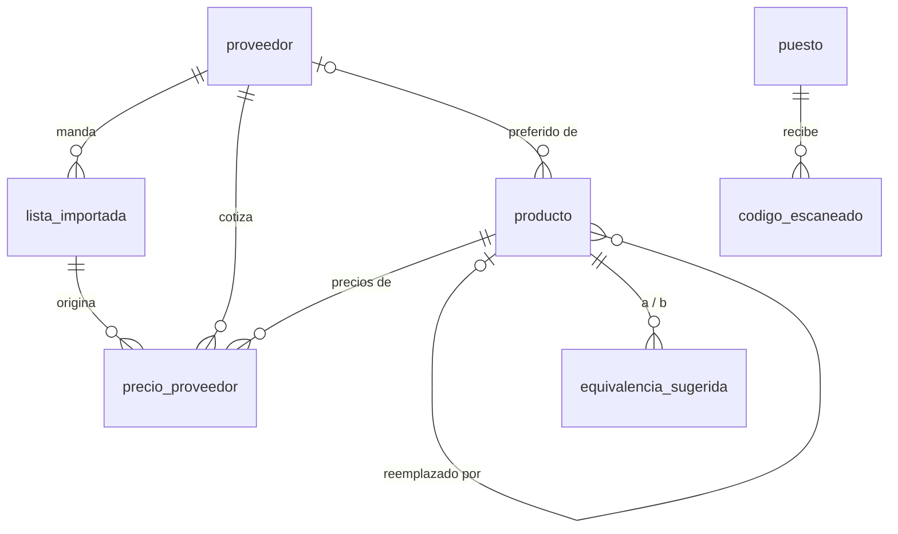

# Modelo de datos: catálogo y precios

Entidades de esta capacidad, tal como quedaron después de las migraciones `0001` a `0011` de
`microservices/gestion-del-local/migrations/`. Fuente: `docs/MODELO.md` y los archivos SQL.
`gestion-del-local` es el único dueño de la base (ADR-003).

## Reglas que valen para todas

- Ids UUID generados por quien crea la fila.
- Nada se borra: `activo` en proveedor y producto, `estado` en lista y sugerencia.
- `precio_proveedor` es un histórico: cada lista agrega filas y el costo vigente es la más
  reciente (por `fecha_lista` y, a igual fecha, `creado_en`). Una fila con el mismo costo y
  el mismo precio de lista que la vigente no se agrega.
- Dinero: `numeric(14,4)` para costos y precios de lista. El precio de venta no se guarda en
  el producto: se calcula del costo vigente, el margen y el IVA.
- `creado_en` en todas; `modificado_en` con trigger en `proveedor`, `lista_importada` y
  `producto`.

## proveedor

Migraciones `0001` y `0003`.

| Campo | Tipo | Qué es |
|---|---|---|
| `id` | uuid, PK | |
| `nombre` | text, único | |
| `precios_incluyen_iva` | boolean, por omisión `false` | Si la lista trae los precios con IVA, se lo quita para llegar al costo neto |
| `descuento_general` | numeric(6,4), entre 0 y 1 | 0,25 = 25 % |
| `descuento_contado` | numeric(6,4), entre 0 y 1 | Se aplica después del general |
| `lector` | text, opcional | Qué lector del servicio de listas entiende su planilla: `ixnova`, `comodo`, `tresge`, `erpa`, o ninguno |
| `activo` | boolean | |

## lista_importada

Cada archivo cargado. Migraciones `0001`, `0003` y `0007`.

| Campo | Tipo | Qué es |
|---|---|---|
| `id` | uuid, PK | |
| `proveedor_id` | uuid → proveedor | |
| `archivo_nombre` | text | Nombre con que se subió |
| `archivo_ruta` | text, opcional | Dónde quedó el original, en el volumen de datos (`CARPETA_LISTAS`); se vuelve a leer para la vista previa y al aplicar |
| `fecha_lista` | date | La que dice la planilla o la que indica quien la carga |
| `estado` | text | `pendiente`, `aplicando`, `aplicada` o `descartada` |
| `resumen` | jsonb | Leídas, salteadas (con el detalle de hasta 50), ofertas, nuevos, modificados, sin cambio, dados de baja, variación promedio; mientras se aplica, el progreso; si falló, el error |
| `avisos` | jsonb | Cosas para mirar que no son errores |
| `cargada_por`, `aplicada_por` | uuid → usuario | Quién la cargó y quién la aplicó |
| `importada_en` | timestamptz | Cuándo terminó de aplicarse |

Las filas de la planilla no se guardan hasta aplicar.

## producto

Lo que se vende. Migraciones `0001`, `0004`, `0006`, `0009` y `0010`.

| Campo | Tipo | Qué es |
|---|---|---|
| `id` | uuid, PK | |
| `descripcion` | text | |
| `marca` | text, opcional | |
| `codigo_barras` | text, opcional | Entre 4 y 32 letras, números o guiones. Viene de la lista o se asocia al escanear un código desconocido |
| `unidad` | text, por omisión `unidad` | `unidad` (cantidades enteras) o `kg`, `m`, `l` (a granel, un decimal) |
| `margen_elegido` | integer, opcional | Porcentaje entero mayor que 0 y hasta 10.000: uno de los botones (300, 200, 100, 50, 25), otro tipeado a mano, o ninguno |
| `proveedor_preferido_id` | uuid → proveedor, opcional | De qué proveedor sale el costo vigente. Al crear el producto es el de la lista; al unir o separar pasa al más barato con lista de los últimos 120 días; se puede fijar a mano |
| `foto_url` | text, opcional | `/fotos/<uuid>.jpg` (subida y guardada en el volumen de datos) o una dirección externa |
| `reemplazado_por` | uuid → producto, opcional | Si fue absorbido por otro al unir duplicados; queda inactivo |
| `sector_id` | uuid → sector, opcional | Dónde vive en el local; lo asigna el conteo (capacidad de compras y stock) |
| `activo` | boolean | |

La columna `precio_manual` del modelo inicial se quitó en la migración `0010`: lo que se fija
a mano es el margen, no el precio.

## precio_proveedor

Histórico de costos por producto y proveedor. Migración `0001`. Guarda el código de cada
proveedor para ese artículo (RF-05).

| Campo | Tipo | Qué es |
|---|---|---|
| `id` | uuid, PK | |
| `producto_id` | uuid → producto | |
| `proveedor_id` | uuid → proveedor | |
| `lista_importada_id` | uuid → lista_importada, opcional | De qué lista salió; permite bajar el Excel original |
| `codigo_proveedor` | text | El código del artículo para ese proveedor; con él se reconoce el producto en la lista siguiente |
| `descripcion_proveedor` | text, opcional | |
| `precio_lista` | numeric(14,4) | Tal como viene en la lista |
| `descuentos` | jsonb | `pasos` (descuentos aplicados en orden, con tipo y porcentaje) y `explicacion` (los pasos en castellano) |
| `costo_neto` | numeric(14,4) | Lo que se paga, sin IVA |
| `iva` | numeric(5,4), por omisión 0,21 | El de la fila |
| `cantidad_bulto`, `precio_bulto` | integer, numeric(14,4), opcionales | |
| `fecha_lista` | date | |

## equivalencia_sugerida

Posibles duplicados entre proveedores. Migración `0006`.

| Campo | Tipo | Qué es |
|---|---|---|
| `id` | uuid, PK | |
| `producto_a`, `producto_b` | uuid → producto | El par, con `producto_a < producto_b`; único |
| `motivo` | text | `codigo_barras` o `descripcion` |
| `estado` | text | `pendiente`, `unida` o `rechazada` |
| `resuelto_en`, `resuelto_por` | timestamptz, uuid → usuario | |

Unir mueve al producto conservado los precios, las ventas, las compras, los movimientos de
stock, las consultas y los renglones de conteo del absorbido. Qué se movió queda en el evento
`producto.unido`, y con ese registro se separa.

## puesto y codigo_escaneado

La computadora vinculada a un celular por QR, y los códigos que el celular le manda.
Migración `0005`.

| Tabla | Campo | Qué es |
|---|---|---|
| `puesto` | `sesion_id` → sesion | La sesión de la computadora |
| | `codigo_hash`, único | El código de un solo uso del QR, hasheado |
| | `nombre` | |
| | `vinculado_en`, `celular_sesion_id` → sesion | Cuándo y con qué sesión de celular se vinculó |
| | `expira_en` | 5 minutos para leer el QR; 12 horas desde que se vincula |
| `codigo_escaneado` | `puesto_id` → puesto | |
| | `codigo` | Lo que leyó el celular |
| | `entregado_en` | Cuándo lo recibió la computadora; lo no entregado se manda al reconectar |

## Eventos que deja esta capacidad

En la tabla `evento` (capacidad de usuarios y registro), siempre con el usuario:
`proveedor.creado`, `proveedor.modificado`, `lista.cargada`, `lista.aplicada`,
`lista.descartada`, `producto.precio_elegido` (todo cambio de margen, unidad, código de
barras, proveedor preferido o foto por la API), `producto.foto`, `producto.unido`,
`producto.separado`, `equivalencia.rechazada` y `puesto.vinculado`.
