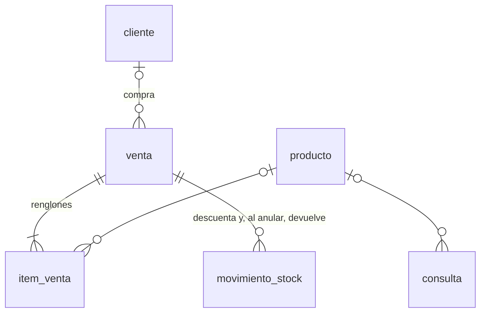

# Data Model: Ventas

El contrato de datos de la capacidad: las tres tablas que son suyas y las de otras
capacidades que la venta toca. El modelo completo está en la capacidad 001.

## Reglas que alcanzan a estas tablas

- **El id lo genera el dispositivo (UUID).** Una venta hecha sin conexión se reenvía con el
  mismo id y no se duplica.
- **Nada se borra.** Una venta anulada cambia de `estado`; no se elimina.
- **Cada renglón guarda el costo, el margen, el precio y la explicación de ese momento**
  (RNF-31): el precio se puede explicar siempre, aunque el costo cambie después.
- **Dinero:** `numeric(14,4)` para costos, `numeric(12,2)` para precios de venta.

## venta

Un ticket: agrupa los renglones del cuaderno de un mismo cliente.

| Campo | Tipo | Qué es |
|---|---|---|
| `id` | uuid, clave | Lo genera el dispositivo |
| `fecha` | timestamptz, obligatorio | Cuándo se vendió (la hora del dispositivo; si no viene, la del servidor) |
| `cliente_id` | uuid → `cliente` | Solo si es a un cliente importante |
| `medio_pago` | texto, obligatorio | `efectivo`, `mercado_pago`, `tarjeta` o `cuenta_corriente` |
| `total` | numeric(12,2), ≥ 0 | Suma de los renglones, cada uno redondeado para arriba a $1.000 (RF-19) |
| `estado` | texto | `confirmada` (por omisión) o `anulada` |
| `pagada_en` | timestamptz | Solo cuenta corriente: cuándo pagó el cliente (RF-40, capacidad de Clientes) |
| `dispositivo_id` | texto | Desde qué dispositivo se creó |
| `creado_en`, `modificado_en` | timestamptz | `modificado_en` se actualiza con trigger |

- Restricción: si `medio_pago` es `cuenta_corriente`, `cliente_id` es obligatorio.
- Índices: por `fecha` descendente; por `cliente_id` para las de cuenta corriente sin pagar.

## item_venta

Un renglón del cuaderno.

| Campo | Tipo | Qué es |
|---|---|---|
| `id` | uuid, clave | |
| `venta_id` | uuid → `venta`, obligatorio | |
| `orden` | entero, obligatorio | Posición del renglón; único dentro de la venta |
| `producto_id` | uuid → `producto` | Nulo = ítem libre (RF-22) |
| `descripcion` | texto, obligatorio | La del producto, o lo tipeado en un ítem libre |
| `cantidad` | numeric(12,3), > 0 | Entera por unidad; con un decimal a granel |
| `costo_neto` | numeric(14,4) | Costo de ese momento |
| `precio_proveedor_id` | uuid → `precio_proveedor` | De qué fila de costo salió; opcional |
| `margen_aplicado` | entero | Margen de ese momento; nulo si el precio se puso a mano o es un ítem libre |
| `precio_unitario` | numeric(12,2), ≥ 0 | Precio por unidad, tal cual; el redondeo del renglón no se guarda acá, va al `total` de la venta |
| `explicacion` | jsonb | Los pasos del precio y los del costo, de ese momento |
| `creado_en` | timestamptz | |

- Índice por `producto_id`.

## consulta

Lo que preguntaron y no llevaron. Una fila por producto del «No llevó».

| Campo | Tipo | Qué es |
|---|---|---|
| `id` | uuid, clave | |
| `fecha` | timestamptz, obligatorio | La pone el servidor al recibirla |
| `producto_id` | uuid → `producto` | Nulo si era un ítem libre |
| `descripcion` | texto, obligatorio | |
| `precio_ofrecido` | numeric(12,2) | Nulo si el renglón no tenía precio |
| `motivo` | texto | Por qué no se vendió (RF-25); opcional |
| `dispositivo_id` | texto | |
| `creado_en` | timestamptz | |

- Índice por `fecha` descendente.

## Tablas de otras capacidades que la venta toca

| Tabla | Capacidad | Cómo la toca la venta |
|---|---|---|
| `movimiento_stock` | Compras y stock | Cada renglón con producto inserta un movimiento `venta` con la cantidad en negativo y referencia a la venta. Anular inserta un movimiento `ajuste` con la cantidad en positivo y la nota «anulación de venta» |
| `evento` | Usuarios y registro | `venta.registrada` y `venta.anulada` (con el motivo), cada uno con el usuario que lo hizo |
| `cliente` | Clientes | Se lee para elegir a quién se le vende a cuenta corriente |
| `producto` | Catálogo y precios | El margen y la unidad elegidos en la venta se guardan en el producto (`margen_elegido`, `unidad`) |
