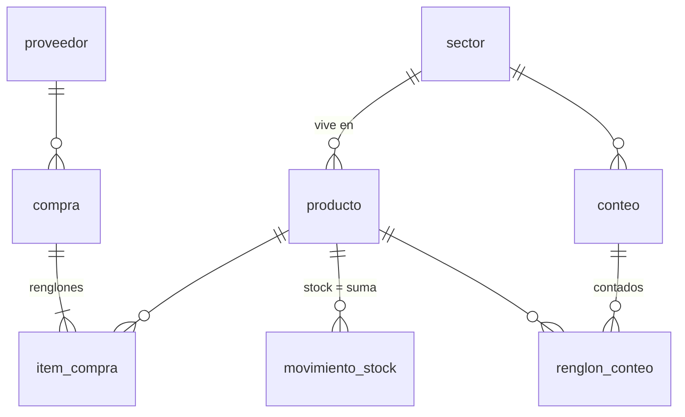

# Modelo de datos: compras y stock

Las tablas del servicio `gestion-del-local` que usa esta capacidad. El modelo completo está
en [001-base-del-sistema/data-model.md](../001-base-del-sistema/data-model.md).

Reglas que valen acá: ids UUID (el de la compra lo genera el cliente, así un reintento no
la duplica); nada se borra (`estado` en documentos, `activo` en catálogos);
`movimiento_stock` y `precio_proveedor` solo reciben filas nuevas; costos en
`numeric(14,4)`, totales en `numeric(12,2)`, cantidades en `numeric(12,3)`.

## compra

Un ingreso de mercadería.

| Columna | Tipo | Detalle |
|---|---|---|
| `id` | uuid, PK | |
| `proveedor_id` | uuid, obligatorio | → `proveedor` |
| `fecha` | date, obligatorio | Fecha del comprobante; por omisión, la del día |
| `comprobante_tipo` | text, obligatorio | `factura`, `remito` o `sin_comprobante` |
| `comprobante_numero` | text | Vacío si no hay comprobante |
| `total` | numeric(12,2), ≥ 0 | Suma de cantidad × costo unitario, sin IVA |
| `estado` | text | `confirmada` (por omisión) o `anulada` |
| `nota` | text | |
| `creado_en`, `modificado_en` | timestamptz | `modificado_en` por trigger |

Índice por `fecha DESC`. Quién la registró o anuló no está en la tabla: queda en `evento`
(`compra.registrada`, `compra.anulada`; el motivo de la anulación va en el evento).

## item_compra

Un renglón de la compra.

| Columna | Tipo | Detalle |
|---|---|---|
| `id` | uuid, PK | |
| `compra_id` | uuid, obligatorio | → `compra` |
| `orden` | integer, obligatorio | Único por compra |
| `producto_id` | uuid, obligatorio | → `producto`. Un producto nuevo se crea antes, con este proveedor como preferido |
| `cantidad` | numeric(12,3), > 0 | |
| `costo_unitario` | numeric(14,4), ≥ 0 | Sin IVA |
| `creado_en` | timestamptz | |

## movimiento_stock

Cada entrada o salida. El stock de un producto no se guarda: es la suma de `cantidad`.

| Columna | Tipo | Detalle |
|---|---|---|
| `id` | uuid, PK | |
| `producto_id` | uuid, obligatorio | → `producto` |
| `tipo` | text, obligatorio | `venta`, `compra` o `ajuste` |
| `cantidad` | numeric(12,3), ≠ 0 | Con signo: compra +, venta −, ajuste ± |
| `referencia_tipo` | text | `venta`, `compra` o `conteo` |
| `referencia_id` | uuid | El documento que lo originó |
| `fecha` | timestamptz, obligatorio | |
| `nota` | text | La explicación del ajuste |
| `creado_en` | timestamptz | |

Índice por `(producto_id, fecha)`. Quién escribe qué en esta capacidad:

| Origen | `tipo` | `referencia_tipo` / `referencia_id` | `nota` |
|---|---|---|---|
| Registrar una compra | `compra` | `compra` / la compra | — |
| Anular una compra | `ajuste` (cantidad negativa) | `compra` / la compra | «anulación de compra» |
| Corregir el stock a mano | `ajuste` | `conteo` / nulo | «había N, hay M: motivo» |
| Cerrar un conteo, producto con diferencia | `ajuste` | `conteo` / el conteo | «conteo de <sector> del <fecha>: había N, hay M» |
| Cerrar un conteo, no contado puesto en cero | `ajuste` | `conteo` / el conteo | «conteo de <sector> del <fecha>: no se encontró ninguno (había N)» |

Los movimientos de tipo `venta` los escribe la capacidad de ventas.

## sector

Dónde vive cada producto en el local.

| Columna | Tipo | Detalle |
|---|---|---|
| `id` | uuid, PK | |
| `nombre` | text, obligatorio, único | |
| `orden` | integer | El siguiente al mayor, al crearlo |
| `activo` | boolean | |
| `creado_en`, `modificado_en` | timestamptz | |

`producto.sector_id` (→ `sector`, con índice) dice en qué sector vive cada producto: se
asigna al contar el producto en un sector.

## conteo

El recuento de un sector.

| Columna | Tipo | Detalle |
|---|---|---|
| `id` | uuid, PK | |
| `sector_id` | uuid, obligatorio | → `sector` |
| `estado` | text | `abierto` (por omisión) o `cerrado` |
| `abierto_en`, `abierto_por` | timestamptz, uuid → `usuario` | |
| `cerrado_en`, `cerrado_por` | timestamptz, uuid → `usuario` | |
| `resumen` | jsonb | Al cerrar: `contados`, `ajustados`, `sin_contar`, `puestos_en_cero`, `diferencia_unidades` |

Índice único parcial: un solo conteo `abierto` por sector.

## renglon_conteo

Lo contado de un producto en un conteo.

| Columna | Tipo | Detalle |
|---|---|---|
| `id` | uuid, PK | |
| `conteo_id` | uuid, obligatorio | → `conteo` |
| `producto_id` | uuid, obligatorio | → `producto`. Único por conteo: volver a contar pisa la cantidad |
| `cantidad_contada` | numeric(12,3), ≥ 0 | |
| `contado_en`, `contado_por` | timestamptz, uuid → `usuario` | |

Es la única tabla de esta capacidad donde una fila se pisa o se borra (mientras el conteo
está abierto).

## Tablas de otras capacidades que esta usa

- **`proveedor`**: se lee para elegir el proveedor de la compra.
- **`producto`**: la compra crea productos nuevos (`descripcion`, `marca`,
  `proveedor_preferido_id`); el conteo le asigna `sector_id`.
- **`precio_proveedor`**: cuando el costo del comprobante difiere del vigente, la
  compra agrega una fila con `precio_lista` y `costo_neto` iguales al costo unitario,
  `fecha_lista` igual a la fecha de la compra, sin `lista_importada_id`, y en `descuentos`
  la explicación `{"pasos": [], "explicacion": ["Costo … según factura … de … del …"]}`.
- **`evento`**: `compra.registrada`, `compra.anulada`, `stock.ajustado`,
  `sector.creado`, `conteo.abierto`, `conteo.cerrado`, con el usuario que lo hizo.
