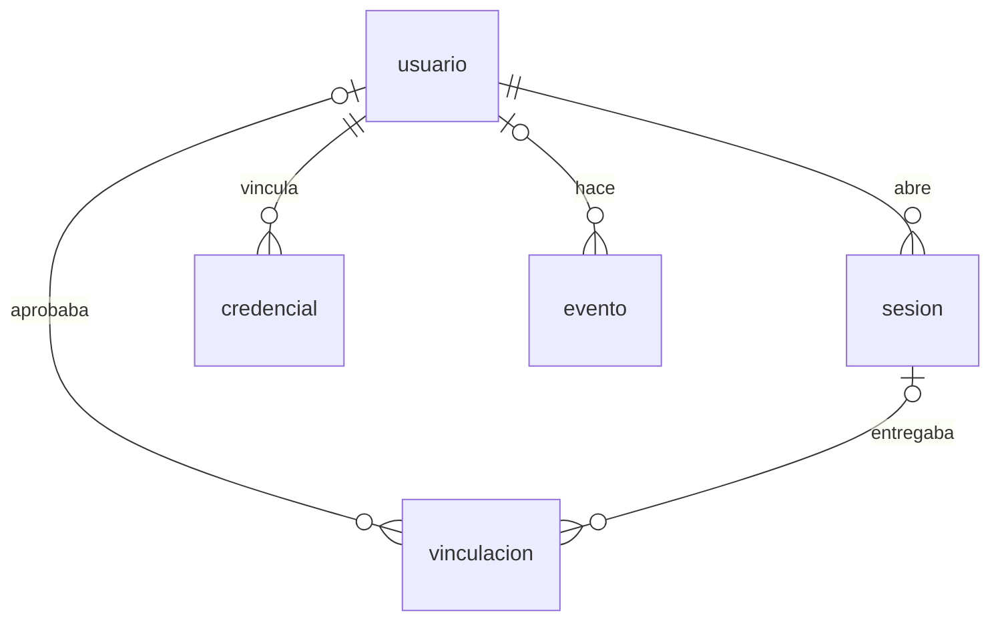

# Modelo de datos: Usuarios y acceso

> El contrato de roles cambia con RF-72: `usuario.rol`, con un solo valor entre `dueño`, `admin` y `mostrador`, pasa a uno o más roles entre Administrador, Vendedor y Comprador.

Contrato de datos del servicio `gestion-del-local` para esta capacidad. Valen las reglas
generales del modelo: nada se borra físicamente y `evento` solo recibe filas nuevas.

## usuario

Quién puede entrar.

| Columna | Tipo | Detalle |
|---|---|---|
| `id` | uuid, clave primaria | Lo genera la API |
| `email` | text, único, obligatorio | El correo de Google; se guarda y se compara en minúsculas |
| `nombre` | text, obligatorio | |
| `rol` | text, obligatorio | `dueño`, `admin` o `mostrador` (restricción `usuario_rol_check`). Uno solo por usuario |
| `activo` | boolean, por omisión `true` | Desactivar es la baja; no se borra |
| `creado_en`, `modificado_en` | timestamptz | `modificado_en` lo mantiene el trigger `usuario_modificado` |

Reglas que aplica la API: nadie se desactiva ni se cambia el rol a sí mismo; el admin no
crea dueños, no modifica a un dueño ni da ese rol; desactivar a un usuario revoca sus
sesiones abiertas. El primer dueño se crea con el comando `crear-usuario` del servicio.

Otras tablas guardan quién hizo algo apuntando a `usuario`: `lista_importada.cargada_por`
y `aplicada_por`, `conteo.abierto_por` y `cerrado_por`, `renglon_conteo.contado_por`,
`equivalencia_sugerida.resuelto_por`.

## sesion

Un dispositivo en el que un usuario está adentro.

| Columna | Tipo | Detalle |
|---|---|---|
| `id` | uuid, clave primaria | |
| `usuario_id` | uuid, obligatorio → `usuario` | |
| `token_hash` | text, único, obligatorio | SHA-256 del token opaco (32 bytes al azar). El token solo existe en el dispositivo |
| `dispositivo` | text | Lo que manda el cliente («celular · Chrome»), o el user agent; hasta 120 caracteres |
| `creada_en` | timestamptz | |
| `ultimo_uso_en` | timestamptz | Se actualiza con el uso, como mucho una vez por hora |
| `expira_en` | timestamptz, obligatorio | 90 días desde que se creó; cada actualización la corre otros 90 |
| `revocada_en` | timestamptz | Cierre: por «Salir», por un Administrador o por desactivar al usuario |

Índice `sesion_por_usuario (usuario_id) WHERE revocada_en IS NULL`. Una sesión vale si no
está revocada, no venció y su usuario está activo.

`puesto.sesion_id` y `puesto.celular_sesion_id` (capacidad de catálogo, RF-08) apuntan a `sesion`: la computadora que muestra el QR y el celular que escanea.

## credencial

Un celular vinculado para entrar con la huella (passkey).

| Columna | Tipo | Detalle |
|---|---|---|
| `id` | text, clave primaria | El identificador que elige el teléfono, en base64url |
| `usuario_id` | uuid, obligatorio → `usuario` | |
| `clave_publica` | bytea, obligatorio | La privada nunca sale del teléfono |
| `contador` | bigint, por omisión 0 | Se actualiza en cada entrada; sirve para detectar una copia |
| `transportes` | text[] | Cómo se comunica el autenticador (por ejemplo `internal`) |
| `dispositivo` | text | El nombre que le puso el usuario («Celular de Carlos») |
| `creada_en` | timestamptz | |
| `ultimo_uso_en` | timestamptz | Última entrada con la huella |
| `revocada_en` | timestamptz | «Quitar»: deja de servir, la fila queda |

Índice `credencial_por_usuario (usuario_id) WHERE revocada_en IS NULL`. El desafío de cada
vinculación o entrada no se guarda en la base: vive 5 minutos en la memoria del proceso.

## evento

Registro de eventos de dominio (ADR-003) y, a la vez, «quién hizo qué». Solo recibe filas
nuevas.

| Columna | Tipo | Detalle |
|---|---|---|
| `id` | uuid, clave primaria | |
| `tipo` | text, obligatorio | `entidad.acción`; los de esta capacidad están abajo |
| `version` | integer, por omisión 1 | Versión del formato de `contenido` para ese tipo |
| `fecha` | timestamptz, obligatorio | Cuándo pasó; el registro se ordena por esta columna |
| `dispositivo_id` | text | |
| `usuario_id` | uuid → `usuario` | Quién lo hizo. Nulo si lo hizo el sistema (el comando `crear-usuario`) |
| `contenido` | jsonb, obligatorio | El evento completo |
| `creado_en` | timestamptz | |

Índices: `evento_por_fecha (creado_en)`, `evento_por_tipo (tipo, creado_en)`,
`evento_por_usuario (usuario_id, creado_en)`.

Tipos que escribe esta capacidad:

| Tipo | Cuándo | Contenido |
|---|---|---|
| `usuario.creado` | Alta desde la app o por comando | `id`, `email`, `rol` (y `medio: "comando"`) |
| `usuario.modificado` | Cambio de rol, nombre o activo | `id`, `cambios` |
| `sesion.iniciada` | Entrada con Google o con la huella | `sesionId`, `dispositivo`, `medio` (`google` o `huella`), `credencial` si fue con huella |
| `sesion.cerrada` | «Salir» o cerrar la propia | `sesionId` |
| `sesion.revocada` | Un Administrador cierra una sesión | `sesionId` |
| `credencial.vinculada` | Se vincula un celular | `id`, `dispositivo`, `tipo` |
| `credencial.quitada` | Se quita un celular | `id` |

Las demás capacidades escriben los suyos (`venta.registrada`, `lista.aplicada`,
`conteo.cerrado`…) con el mismo `usuario_id`.

## vinculacion

Código de un solo uso para entrar en la computadora leyendo un QR con el celular. Esa forma
de entrar se quitó (RF-70; ADR-011, enmienda del 2026-10-09): la tabla se conserva porque
nada se borra, no recibe filas nuevas y ninguna ruta la lee.

| Columna | Tipo |
|---|---|
| `id` | uuid, clave primaria |
| `codigo_hash` | text, único, obligatorio |
| `dispositivo` | text |
| `creada_en`, `expira_en` | timestamptz |
| `aprobada_en` | timestamptz |
| `aprobada_por` | uuid → `usuario` |
| `sesion_id` | uuid → `sesion` |
| `retirada_en` | timestamptz |
